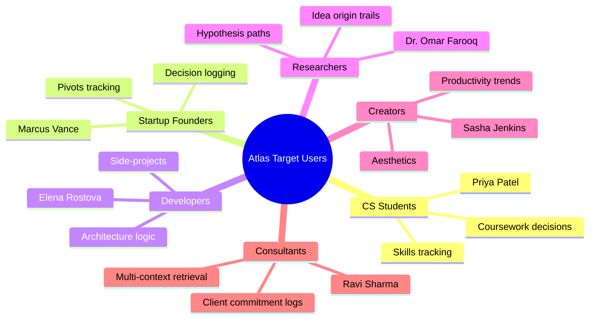
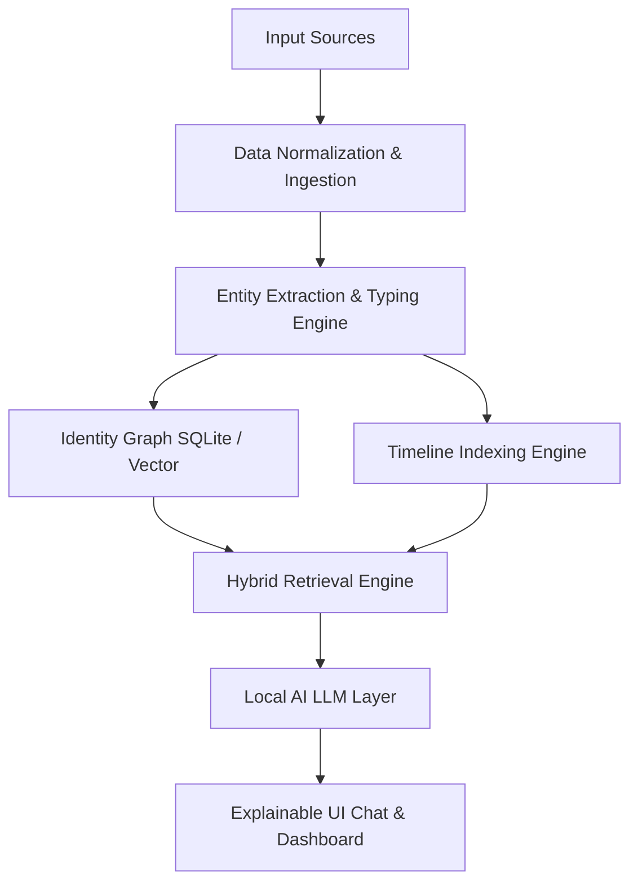
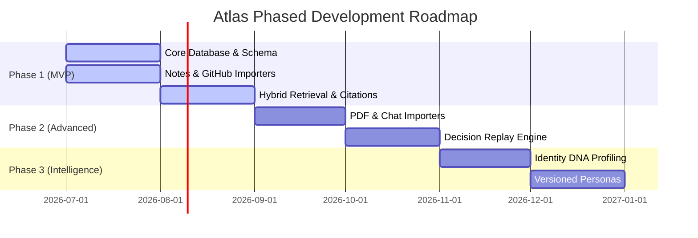
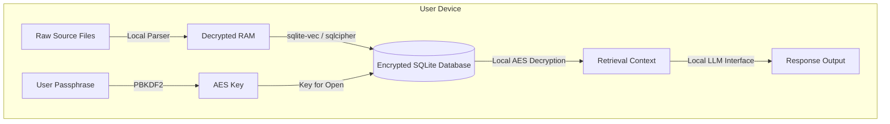

# ATLAS — Product Requirements Document (PRD)
**Document 1 of 7 · Version 1.0 · Technical Specifications**

---

## 1. Executive Summary

Atlas is a **Local-First AI Identity System**—a new class of computing platform designed to ingest, structure, and understand the entirety of an individual's digital life to build a living, time-aware model of their identity. 

Existing personal AI systems and note-taking apps focus on text retrieval (RAG) over document archives or flat conversation histories. They treat the user’s mind as static and their data as flat. Atlas redefines this paradigm by modeling **identity over information**. It extracts structured entities (Memories, Events, Projects, Goals, Skills, Habits, Beliefs, Decisions, Relationships) and organizes them into an **Identity Graph** anchored to a high-fidelity **Timeline Engine**.

By utilizing local model execution (Llama, Gemma, Qwen, Phi) and local vector/graph indexing, Atlas ensures complete data privacy. No user accounts are required, no data ever leaves the user’s device, and zero telemetry is collected. Atlas is an extension of the human mind: private, explainable, and chronologically aware.

---

## 2. Vision & Mission

### 2.1 Vision
To give every human a permanent, private, and structured extension of their own memory and identity—a cognitive companion that understands who they were, who they are, and how they are evolving over time.

### 2.2 Mission
To architect a local-first, time-aware identity database that transforms scattered digital interactions into structured personal growth, operating with absolute privacy, complete data ownership, and transparent explainability.

---

## 3. Product Philosophy

*   **Absolute Privacy by Architecture:** Privacy is not a settings toggle; it is an architectural constraint. Local compute, local storage, and local embeddings are mandatory. There is no cloud fallback.
*   **Time is the Primary Dimension:** Humans are not static text files. Beliefs change, relationships shift, and skills progress. Every entity in Atlas is versioned, timestamped, and framed in time.
*   **Structured Identity over Flat Information:** Documents are mere transport containers. Atlas dissects files to extract entities and build relationships, prioritizing the underlying human profile over the raw files themselves.
*   **Explainable Intelligence:** If the AI makes an assertion about the user (e.g., "You tend to lose consistency on side projects after 3 weeks"), it must show the mathematical confidence level, compile a timeline of events, and link directly to the local source files as evidence.

---

## 4. Problem Statement

Modern digital life is fragmented across dozens of siloed applications. A user’s notes live in Obsidian, code commits in GitHub, calendar events in Google Calendar, messaging records in WhatsApp, and health metrics in Apple Health. 

This fragmentation results in several key points of failure:
1.  **Context Amnesia:** Users cannot reconstruct the exact logic behind past decisions (e.g., "Why did I choose this database architecture in 2024?").
2.  **Growth Blindness:** Self-perception is distorted by recency bias. There is no automated, objective way to trace personal skill progression or behavioral trends over years.
3.  **The RAG Flat-Pile Failure:** Current search and retrieval engines treat a note written in 2022 and one written in 2026 as equal context. They fail to understand temporal contradictions, treating changes in values or goals as database errors rather than natural human evolution.
4.  **The Privacy Tradeoff:** Handing over sensitive data (diaries, private messages, financial files) to commercial cloud LLMs represents an unacceptable security risk for most individuals.

---

## 5. Competitive Analysis

Atlas addresses the critical gap between passive personal knowledge management (PKM) and invasive, cloud-first AI recorders.

### 5.1 Competitor Comparison Matrix

| Feature / Axis | Notion AI | Obsidian (Local) | Mem.ai | Rewind AI | Personal.ai | ChatGPT Memory | Google Gemini | Apple Intelligence | **Atlas (Local-First)** |
| :--- | :--- | :--- | :--- | :--- | :--- | :--- | :--- | :--- | :--- |
| **Data Ownership** | Cloud (Proprietary) | Local (Markdown) | Cloud (Proprietary) | Local (Encrypted) | Cloud (Proprietary) | Cloud (OpenAI) | Cloud (Google) | Local/Cloud hybrid | **Local (SQLite/Vector)** |
| **Identity/Graph Model** | No | Manual Links | No | No | Persona Profile | Flat Text | No | Semantic Index | **Yes (Typed Entities)** |
| **Time-Awareness** | No | No | No | Chronological | No | No | No | Contextual | **Yes (Timeline Engine)** |
| **Cross-Source Ingest** | Manual / Slack | Community Plugins | Email / Sync | Screen/Audio Rec | Text / Audio | Chat-only | Workspace only | System-wide | **Automatic Importers** |
| **Model Location** | Cloud | Local Plugins | Cloud | Local (quantized) | Cloud | Cloud | Cloud | Hybrid (PCC) | **100% On-Device** |
| **Explainable Citations** | Doc Links | No | No | Screen Timestamps | Persona source | Stated facts | File links | No | **Full Graph Evidence** |
| **Temporal Personas** | No | No | No | No | Static clone | No | No | No | **Yes (Past/Present/Future)** |
| **Self-Reflection Engine**| No | No | No | No | No | No | No | No | **Yes (Weekly/Yearly)** |
| **Zero Telemetry** | No | Yes | No | No | No | No | No | No | **Yes (Hard Constraint)** |

---

## 6. Why Current Solutions Fail

*   **Notion AI:** Locked into a cloud ecosystem. Fails to import external developer metadata (e.g., Git commits) or private chat logs, and lacks temporal versioning.
*   **Obsidian:** While local-first, it requires high manual effort to maintain links. AI integration is fragmented across third-party community plugins without a unified graph representation.
*   **Rewind AI / Limitless:** Captures screen and audio logs chronologically. While useful for finding "what I saw," it is a raw recording engine rather than an intelligence engine. It cannot structure a user's *identity* or model conceptual connections.
*   **Personal.ai:** Attempts to train a digital clone in the cloud. It lacks deep timeline awareness, suffers from high latency, and requires uploading highly intimate data to their servers.
*   **Apple Intelligence:** Possesses strong local/private system integrations, but is locked into Apple's hardware ecosystem and lacks reflective features, multi-year timeline navigation, or developer integrations.

---

## 7. Target Audience & User Personas

Atlas target users are self-reflective, technically proficient, and highly protective of their digital privacy.

### 7.1 Detailed User Personas

#### Persona 1: Priya Patel, 21 — Computer Science Student
*   **Background:** CS major at Georgia Tech, active hackathon developer, applying for machine learning internships.
*   **Use Case:** Tracking project histories, matching specific university courses to skill acquisitions, and analyzing how her career goals have shifted from web development to deep learning.
*   **Key Pain Point:** Struggles to write project narratives for interviews because she forgets her debugging struggles and specific technical decisions from semesters past.

#### Persona 2: Marcus Vance, 34 — Startup Founder (Series A)
*   **Background:** Former engineer, now managing a 15-person distributed AI startup. Pivoted twice in the last 18 months.
*   **Use Case:** Using the "Decision Replay" tool to review previous product strategies and hiring philosophies. Reconstructing "why did we decide against building our own orchestration layer in 2025?".
*   **Key Pain Point:** Teams re-litigate decisions that were settled months prior because the trade-off discussions were scattered across Slack, docs, and calendar notes.

#### Persona 3: Elena Rostova, 28 — Software Engineer & Side-Project Builder
*   **Background:** Senior Dev at a mid-sized SaaS company. Maintains four open-source libraries and writes tech blogs.
*   **Use Case:** Automatic ingestion of local Git repositories, mapping code changes to personal journal reflections to observe how work environment stress affects code design.
*   **Key Pain Point:** Feels she isn't growing professionally but lacks concrete evidence to trace her progression in architectural systems design over a multi-year horizon.

#### Persona 4: Dr. Omar Farooq, 41 — Academic Researcher & Lab Director
*   **Background:** Associate Professor in Bioinformatics, managing multiple grant projects and clinical collaboration contracts.
*   **Use Case:** Tracking hypothesis evolution over years. Tracing where an idea in a new draft manuscript originated in his years of academic notes and paper reviews.
*   **Key Pain Point:** Scientific theories and citations get lost in isolated text files, leading to missed linkages between historical ideas and current research projects.

#### Persona 5: Sasha Jenkins, 26 — Multi-Platform Content Creator
*   **Background:** Produces videos, newsletters, and podcasts on digital design, tech culture, and cognitive tools.
*   **Use Case:** Ingesting transcripts, browser history, and reading highlights to identify what inputs (books, podcasts) correlate with her highest-performing content outputs.
*   **Key Pain Point:** No structured system to analyze her creative pipeline or identify recurring patterns of creative blockage and high-output periods.

#### Persona 6: Ravi Sharma, 45 — Independent Management Consultant
*   **Background:** Ex-McKinsey consultant, now advising five separate enterprise clients on digital transformation.
*   **Use Case:** Storing client meeting notes, calendar markers, and local emails to query commitments made across clients without cross-contaminating client data.
*   **Key Pain Point:** Context switching leads to cognitive fatigue. Struggles to recall specific verbal commitments made to Client A while drafting proposals for Client B.

---

## 8. User Pain Points

1.  **Hindsight Bias in Self-Reflection:** Inability to look back at past states of mind without current knowledge coloring the memory.
2.  **Fragmented Knowledge Provenance:** Losing track of *why* an idea was formed, *what* notes inspired it, and *who* it was discussed with.
3.  **Data Dispersal (Siloing):** Scattered inputs (GitHub, Obsidian, WhatsApp, PDFs) lack a single unifying index or relational layer.
4.  **AI Hallucination on Personal Facts:** Generic AI assistants make up details about the user's life because they do not have a grounded, structured graph database from which to retrieve context.
5.  **Telemetry and Data Leakage Anxiety:** Reluctance to use cloud-based personal assistants due to strict employer compliance standards, NDA obligations, or personal privacy philosophies.

---

## 9. Product Goals & Non-Goals

### 9.1 Product Goals
*   **On-Device Entity Extraction:** Parse text, metadata, and files locally to extract structured nodes and edges.
*   **Unified Temporal Graph:** Map all extracted entities to a timeline, preserving chronological history and version records.
*   **Citable RAG Interface:** Provide conversational answers to personal questions, backed by clickable, local file links.
*   **Evidence-Based Profiling:** Generate an "Identity DNA" profile representing core values, learning styles, and motivators.
*   **Absolute Data Ownership:** Guarantee that a user's data remains under their local physical control with open-standard export capabilities.

### 9.2 Non-Goals
*   **No Cloud Synced Versioning by Default:** Atlas will not launch with a cloud-sync feature in its MVP. Multi-device sync is pushed to later phases and must be end-to-end encrypted.
*   **Not a Diagnostic Tool:** Atlas will not diagnose mental health conditions or offer clinical recommendations based on mood data or journaling.
*   **Not a Daily Productivity Planner:** Atlas is not a task manager or calendar app; it does not replace Todoist, Google Calendar, or Obsidian. It ingests their histories to build an identity index.
*   **No Social Features:** Atlas is strictly personal. There are no sharing mechanisms, collaborative workspaces, or public profile publishing pipelines.

---

## 10. Functional Requirements

### 10.1 Data Ingestion & Importers
*   **FR-1.1:** The system must import local folders of Markdown and plaintext files (Obsidian, Logseq, standard text directories).
*   **FR-1.2:** The system must connect to the local Git configuration to parse commits, diff metadata, and language usage flags.
*   **FR-1.3:** The system must support manual calendar imports via `.ics` file paths and read calendar events from configured local client calendars.
*   **FR-1.4:** The system must support importing WhatsApp, Discord, and Telegram chat exports, parsing speaker metadata, and mapping participants to relationship edges.
*   **FR-1.5:** The system must import local PDF files and extract structured highlights, citations, and author lists.
*   **FR-1.6:** The system must parse browser history databases (`history.db` from Chrome/Firefox/Safari) to extract visited topics and learning trends.
*   **FR-1.7:** The system must allow users to define file-path exclusion blacklists and regular expressions to ignore specific files, directories, or terms during import.

### 10.2 Entity Extraction & Typing Engine
*   **FR-2.1:** The system must scan imported documents to extract defined entity types: `Memory`, `Event`, `Project`, `Goal`, `Skill`, `Habit`, `Belief`, `Decision`, `Relationship`, `Person`, `Organization`, `Place`, `Document`.
*   **FR-2.2:** The system must calculate a confidence score ($0.0$ to $1.0$) for each automatically extracted entity based on the clarity and volume of source references.
*   **FR-2.3:** The system must preserve the source document file path, file modification date, and line range as metadata for every extracted entity.
*   **FR-2.4:** The system must perform entity resolution (deduplication) to prompt users to merge highly similar entities (e.g., merging "Git" and "Github" as skills).

### 10.3 Timeline Engine
*   **FR-3.1:** The system must assign a precise timestamp or duration to every entity in the graph.
*   **FR-3.2:** The system must maintain version history for evolving entities (e.g., if a user's "Belief" in "Startups over Corporate" changes in 2026, the prior version from 2024 is preserved as a historical node linked to the new version).
*   **FR-3.3:** The system must support temporal slicing, allowing the retrieval engine to execute queries restricted to state-of-mind parameters prior to a specific cutoff date.

### 10.4 Retrieval & AI Interface
*   **FR-4.1:** The system must support hybrid retrieval combining semantic vector search, structured graph traversal, and timeline windows.
*   **FR-4.2:** The system must stream chat responses from a local LLM executing on the user's CPU/GPU.
*   **FR-4.3:** Every chat response must render a collapsible side panel displaying the exact source nodes used, their confidence rating, and their file system paths.
*   **FR-4.4:** The system must provide "Past You" persona switches, blocking any context generated after the user-specified historical date.
*   **FR-4.5:** The system must provide a visual representation of the Identity Graph using a force-directed node-link diagram with interactive filters for entity types and relationship strengths.

### 10.5 Reflection & Pattern Detection
*   **FR-5.1:** The system must run a local background pipeline at scheduled intervals (e.g., Sunday night) to generate a Weekly Reflection report summarizing projects worked on, habits tracked, and mood indicators.
*   **FR-5.2:** The system must highlight recurring behavioral patterns (e.g., "Documentation output peaks on Friday mornings following high physical activity on Thursdays") backed by graph evidence.
*   **FR-5.3:** The system must provide a user-facing dashboard showing the "Identity DNA" profile representing core values, learning styles, and motivators extracted from the graph. Users must have the ability to edit or delete any inferred DNA trait.

---

## 11. Non-Functional Requirements

### 11.1 Privacy & Security (NFR-1)
*   **NFR-1.1 (Local Isolation):** The system must not make external network requests to process user text or metadata. All inference, vector creation, and graph storage must occur on the local host.
*   **NFR-1.2 (Encryption-at-Rest):** The database (SQLite/Vector index) must be encrypted using AES-256-GCM. The decryption key must be derived from the user's master passphrase using PBKDF2 with SHA-256.
*   **NFR-1.3 (Zero Telemetry):** The software must contain no crash reporting, analytics trackers, or usage metric beacons.

### 11.2 Performance & Resource Management (NFR-2)
*   **NFR-2.1 (LLM Latency):** The local LLM must stream text at a minimum rate of 15 tokens per second on target consumer machines (M-series Apple Silicon with 16GB RAM or Intel/AMD x86 with dedicated 6GB+ VRAM).
*   **NFR-2.2 (RAG Speed):** Hybrid search and context compilation must complete in under 500ms before LLM generation begins.
*   **NFR-2.3 (System Footprint):** Ingestion processes running in the background must not exceed 20% CPU utilization and 2GB RAM when the system is actively in use by other applications.

### 11.3 Data Portability (NFR-3)
*   **NFR-3.1 (Open Export):** The system must export the entire Identity Graph (nodes, edges, timeline sequences) in JSON and Markdown formats with a single user action.
*   **NFR-3.2 (No Proprietary Lock-in):** Schema structures must be open-sourced, allowing developers to read and reconstruct database states using standard SQLite tools.

---

## 12. MVP Scope vs. Future Roadmap

### 12.1 Phase 1: MVP Scope
*   **Core Database:** Local encrypted SQLite DB with `sqlite-vec` extension.
*   **Importers:** Local Notes (Obsidian/Markdown), Journals, Calendar (.ics), and GitHub (local config parser).
*   **Core Logic:** Timeline Engine (basic mapping) and hybrid vector + keyword search.
*   **Interface:** Chat console with source file references and simple horizontal timeline visualizer.
*   **Privacy:** Master password setup and AES-256 database protection.

### 12.2 Phase 2: Advanced Ingestion & Retrieval
*   **Importers:** WhatsApp, Telegram, PDF highlighter, browser history parser.
*   **Intelligence:** Decision Replay (retrieving the context group around specific decision nodes).
*   **UI/UX:** Full interactive force-directed graph canvas, advanced multi-source dashboard.

### 12.3 Phase 3: Core Identity Intelligence
*   **Intelligence:** "Past You" temporal persona switching, Automated Weekly/Monthly reflections.
*   **Profiling:** Identity DNA analysis dashboard (Values, motivators, strengths/weaknesses).
*   **UI/UX:** Pattern detection alert logs, custom entity type modeler.

### 12.4 Phase 4: Long-Term Integrations
*   **Sync:** End-to-end encrypted multi-device local sync (via peer-to-peer Wi-Fi or custom keys).
*   **Teams:** Co-founder/Team Graph layer (collaborative identity indexes with split access controls).
*   **Extensibility:** SDK and plugin marketplace for developer-written importers.

---

## 13. Detailed User Stories

*Format: As a [persona], I want to [action], so that [outcome].*

### 13.1 Setup & Ingestion (Stories 1–12)

1.  **As a new user,** I want to create a local passphrase during setup, so that my personal database is encrypted at rest.
2.  **As a privacy-focused user,** I want to view a manifest of all local file reads during ingestion, so that I can audit exactly what the application is accessing.
3.  **As Elena (Developer),** I want to select specific directory paths for my Obsidian notes during onboarding, so that Atlas knows where my primary thoughts are recorded.
4.  **As Priya (Student),** I want to track the data sync progress in a progress bar, so that I know when Atlas has finished parsing my files.
5.  **As Ravi (Consultant),** I want to exclude specific project names or clients using a blacklist, so that confidential corporate materials are never ingested.
6.  **As Marcus (Founder),** I want to input my local Git repository directory, so that Atlas can automatically index my commit patterns.
7.  **As Sasha (Creator),** I want to upload a `.zip` export of my WhatsApp chat logs, so that Atlas can capture my conversation threads with my creative partners.
8.  **As Dr. Omar (Researcher),** I want to link my PDF collection directory, so that Atlas can extract my research library details.
9.  **As a user,** I want to set a sync schedule (e.g., hourly or daily), so that Atlas updates its database without manually triggering updates.
10. **As a user,** I want to pause a running import, so that I can save CPU cycles for resource-intensive local tasks.
11. **As a user,** I want to see which sources failed to sync and why, so that I can resolve path permissions or file format errors.
12. **As a user,** I want to import my Apple Health XML export file, so that Atlas can correlate my physical activity with my mental focus levels.

### 13.2 Entity Extraction & Resolution (Stories 13–22)

13. **As Dr. Omar (Researcher),** I want Atlas to extract paper references as `Document` entities, so that I can see links between research notes and sources.
14. **As Elena (Developer),** I want to view the source document context of an extracted `Decision` entity, so that I can verify the context behind the extraction.
15. **As a user,** I want the system to calculate an extraction confidence level for every entity, so that I know when the model is making assumptions.
16. **As Marcus (Founder),** I want to manually merge "V-AI" and "Verdict AI" entities, so that my graph represents a single unified project instead of two.
17. **As Priya (Student),** I want to delete a misidentified `Skill` entity, so that it does not show up in my profile.
18. **As Ravi (Consultant),** I want to tag a relationship edge between myself and an organization manually, so that I can represent structured links that the AI missed.
19. **As a user,** I want to define custom entity types (e.g., "Experiment" or "Sermon"), so that the database structure fits my specific lifestyle.
20. **As a developer,** I want Atlas to tag languages used in GitHub commits as `Skill` nodes, so that my language capabilities are automatically documented.
21. **As a user,** I want to see a history of all manual edits I have made to entities, so that I can revert incorrect changes.
22. **As a user,** I want to filter entities by extraction confidence, so that I can easily review and validate low-confidence data points.

### 13.3 Timeline & Chronological Tracking (Stories 23–31)

23. **As a user,** I want to browse my extracted life history as a horizontal scrollable timeline, so that I can see the timing of projects, relationships, and decisions.
24. **As Priya (Student),** I want to zoom in on my timeline from year to month and day views, so that I can locate specific events.
25. **As Marcus (Founder),** I want to isolate the timeline to show only `Decision` entities, so that I can trace my strategic pivots.
26. **As Elena (Developer),** I want to see my `Skill` nodes linked to a timeline, so that I can see when I first learned React vs. when I used it for a major project.
27. **As a user,** I want to view my timeline in "point-in-time" mode, so that I can inspect the state of my goals and beliefs on a specific historical date.
28. **As Sasha (Creator),** I want to see chronological connections between my research topics and my published scripts, so that I can understand my creative cycle.
29. **As a user,** I want to add manual timeline markers for major life events (e.g., "Moved to Atlanta"), so that my data is organized around milestones.
30. **As Ravi (Consultant),** I want to view client communications and calendar events side-by-side on the timeline, so that I can trace the lifecycle of a client dispute.
31. **As a user,** I want gaps in my timeline (e.g., periods with no imports) highlighted, so that I can see where my digital records are incomplete.

### 13.4 Chat & Retrieval (Stories 32–40)

32. **As a user,** I want to ask questions in natural language (e.g., "What was I doing in August 2025?"), so that I can retrieve information without complex queries.
33. **As Ravi (Consultant),** I want to receive clickable citations in my chat answers, so that I can open the source notes and confirm details.
34. **As Dr. Omar (Researcher),** I want to search for conceptual connections (e.g., "How does my work on protein structure link to gene regulation?"), so that I can discover hidden patterns in my notes.
35. **As Marcus (Founder),** I want Atlas to show a confidence classification (High, Medium, Low) on its answers, so that I know when to double-check its facts.
36. **As Priya (Student),** I want to run a query using an advanced filter (e.g., search within a specific date range and source type), so that I can refine my search.
37. **As a user,** I want to toggle between different local LLM models (e.g., Qwen 7B vs. Llama 8B), so that I can choose between speed and reasoning quality.
38. **As Elena (Developer),** I want to save recurring complex queries to my dashboard, so that I can quickly check update trends.
39. **As a user,** I want to flag chat responses that are incorrect, so that Atlas adjusts its future retrieval weights.
40. **As a user,** I want my chat session history saved locally, so that I can resume previous inquiries.

### 13.5 Temporal Personas & Simulation (Stories 41–45)

41. **As Marcus (Founder),** I want to chat with the "April 2024" version of myself, so that I can understand my product logic before a major pivot without hindsight bias.
42. **As a user,** I want a strict block on future information when using a past persona, so that the AI does not reference developments that had not occurred yet.
43. **As Sasha (Creator),** I want to ask my "Future Projection" persona what my channel trajectory looks like based on my goals, so that I can simulate potential workloads.
44. **As Priya (Student),** I want my "Future Projection" answers to clearly state the assumptions and uncertainties used, so that I do not mistake them for facts.
45. **As a user,** I want to save a temporal snapshot of my graph (e.g., "Graduate Student Self"), so that I can lock that state of mind for future comparisons.

### 13.6 Reflection & Identity DNA (Stories 46–50)

46. **As a user,** I want to receive an automated weekly reflection report, so that I can review my accomplishments and habits without manual effort.
47. **As Sasha (Creator),** I want to view my extracted "Identity DNA" values on my profile page, so that I can see what topics and motivators Atlas has mapped.
48. **As Elena (Developer),** I want Atlas to highlight my productivity patterns (e.g., "Deep work is highest on Tuesdays"), so that I can optimize my work schedules.
49. **As Ravi (Consultant),** I want to edit or delete any trait in my "Identity DNA" profile, so that I maintain ultimate control over my represented profile.
50. **As a user,** I want my reflections to link to the source files, projects, and events that support its findings, so that the summaries are verifiable.

---

## 14. Critical Acceptance Criteria

To ensure production quality, core user stories must meet strict validation rules:

### 14.1 AC-1: Time-Scoped Personas (User Story 41)
*   **Scenario:** Running the retrieval engine under a Past-Persona filter.
    *   **Given** a user has set a temporal cutoff date of `2024-06-01`.
    *   **And** the database contains entities dated both before and after `2024-06-01`.
    *   **When** the user asks a question via the chat interface (e.g., "What is the status of my main project?").
    *   **Then** the hybrid retrieval system must filter out all nodes, edges, and vector matches timestamped after `2024-06-01`.
    *   **And** the local LLM response must not contain references to any events, skills, or projects started after the cutoff date.
    *   **And** the UI must display a persistent visual indicator highlighting that "Past Persona" mode is active.

### 14.2 AC-2: On-Device Isolation & Privacy (User Story 2)
*   **Scenario:** Verifying offline operations.
    *   **Given** the user is running Atlas in default configuration.
    *   **When** the user performs ingestion, vector embedding generation, graph query, or LLM inference.
    *   **Then** the application must make zero TCP/UDP connections to external IP addresses.
    *   **And** the application must function normally without an active internet connection.

### 14.3 AC-3: Explainable Citations (User Story 33)
*   **Scenario:** Generating citable chat output.
    *   **Given** the retrieval engine has surfaced context nodes to answer a query.
    *   **When** the AI output is rendered on screen.
    *   **Then** every factual claim derived from a database node must display an inline citation marker (e.g., `[1]`).
    *   **And** hovering over the marker must show the entity type, source file path, and extraction confidence score.
    *   **And** clicking the marker must open the exact line range of the source file in the local file viewer.

---

## 15. Privacy Model & Local Storage Strategy

### 15.1 Encryption Architecture
*   **Key Derivation:** The database is protected using SQLCipher. The key is derived from the user's master passphrase via PBKDF2 with 100,000 iterations and a local cryptographic salt.
*   **Memory Management:** Decrypted plaintext data must reside in memory only. Swapping decrypted structures to disk is disabled using local memory locking where supported by the OS.

### 15.2 Ingestion & Redaction Rules
To respect the privacy of third parties (e.g., participants in chat exports or emails):
*   **PII Masking:** Names, email addresses, and phone numbers of contacts not explicitly marked as "Key People" are hashed locally before graph writing.
*   **No Raw Text Storage:** While metadata and relationships are indexed in SQLite, the raw body text of chats and emails is not copied into the central database. Instead, Atlas indexes semantic vector representations and maps metadata, maintaining a reference pointer to the original local source file.

---

## 16. Technical Key Performance Indicators (KPIs)

*   **KPI-1 (Retrieval Latency):** Vector database lookups and graph index lookups must finish in less than 200ms for database sizes up to 100,000 nodes.
*   **KPI-2 (Ingestion Throughput):** The parsing and vector creation pipeline must process text at a minimum speed of 100 documents per minute on base M1 Apple Silicon machines.
*   **KPI-3 (Accuracy Metric):** The entity resolution system must maintain a precision of $\ge 92\%$ on automated de-duplication recommendations.
*   **KPI-4 (Database Footprint):** The storage index size (database + vector index files) must not exceed 2.5 GB per 50,000 processed markdown files.

---

## 17. Risks & Assumptions

### 17.1 Risks
*   **R-1 (Resource Exhaustion):** Local LLMs and embedding processes can saturate system memory and thermal capacity on low-end laptops, leading to app crashes or OS lag.
*   **R-2 (Ingestion Inconsistencies):** Frequent changes in third-party file formats (e.g., WhatsApp export structure updates) can break local parsers.
*   **R-3 (Model Reasoning Constraints):** Small on-device models (e.g., Qwen 7B) may struggle with long-context retrieval instructions and hallucinate connections across distant graph clusters.

### 17.2 Assumptions
*   **A-1:** The target user runs on an operating system with sufficient file read permissions to access specified notes and project directories.
*   **A-2:** The user has at least 8 GB of unallocated RAM available to initialize the local LLM and vector layers.
*   **A-3:** Users maintain standard markdown file formats and avoid highly nested, non-standard custom syntax.
