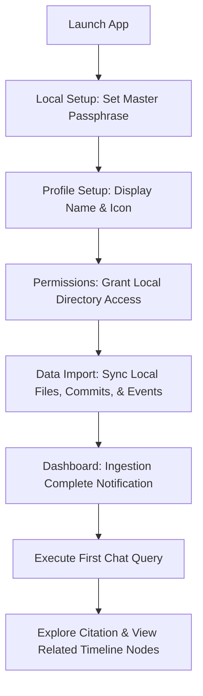
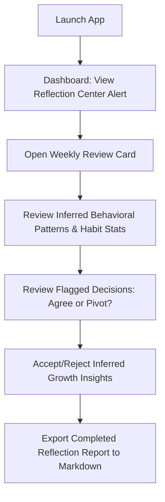
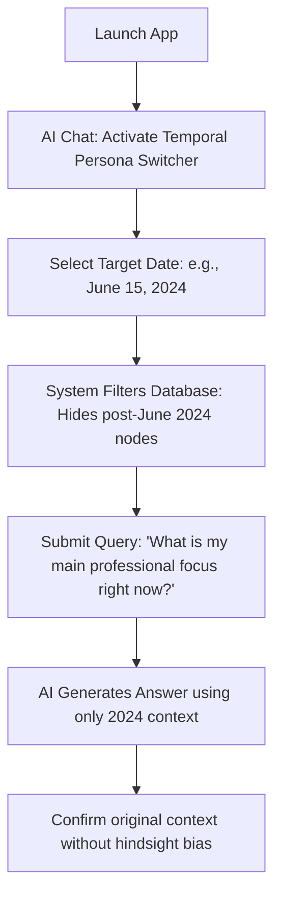
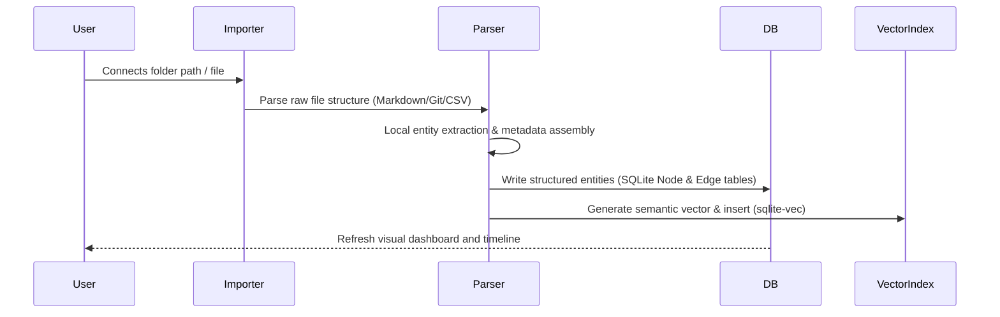
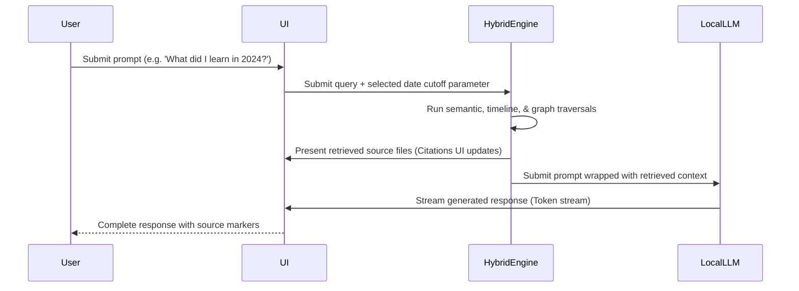

# ATLAS — User Experience & App Flow Document
**Document 2 of 7 · Version 1.0 · Technical Specifications**

---

## 1. Information Architecture & Navigation Structure

Atlas features an intuitive, unified interface that prioritizes distraction-free interaction and deep exploration. The navigation architecture is organized into primary modules accessible via a persistent sidebar (or bottom bar on mobile), secondary sub-views nested within major sections, and utility screens.

### 1.1 Structural Hierarchy

*   **Primary Navigation (Sidebar):**
    *   **Dashboard:** High-level personal summary, reflections, and quick actions.
    *   **Timeline:** Chronological flow of all life events and entities.
    *   **Identity Graph:** Visual link-node explorer of the personal knowledge base.
    *   **AI Chat:** Natural language conversational interface with temporal controls.
    *   **Search:** Multi-dimensional filtered query portal.
*   **Secondary Context Views (Dynamic Rails / Tabs):**
    *   *Graph Sub-views:* Projects, Goals, Habits, People, Knowledge.
    *   *Timeline Sub-views:* Calendar View, Memories Grid (Photos/Media).
    *   *Dashboard Sub-views:* Reflection Center.
*   **Utility & Settings (Bottom-Sidebar):**
    *   **Settings:** Access to Permissions, Backup & Restore, Plugin Manager, and Profile.

---

## 2. Core User Journeys

### 2.1 First-Time User Ingestion & Discovery

### 2.2 Weekly Reflection & Pivot Review

### 2.3 Historical Persona Inquiry ("Past You" mode)

---

## 3. Screen-by-Screen Specifications

### 3.1 Onboarding
*   **Purpose:** Introduce the product, explain local-first architecture and limits, and prepare the environment.
*   **Inputs:** None (informational pages).
*   **Outputs:** Acknowledgement clicks, transition trigger.
*   **User Actions:** Read key screens (Local Isolation, Time Axis, Graph Structure); click "Continue".
*   **Navigation:** Next step leads directly to Local Setup.
*   **Edge Cases:** User force-quits during onboarding. *Solution:* Application checks onboarding flag on launch and resumes from the uncompleted screen.
*   **Loading States:** Instant transition; no heavy backend tasks exist here.
*   **Empty States:** N/A.
*   **Error States:** N/A.

### 3.2 Local Setup
*   **Purpose:** Establish physical security via cryptographic key derivation.
*   **Inputs:** Master passphrase, passphrase confirmation, optional biometric registration prompt.
*   **Outputs:** Generated local database salt, AES-256 master decryption key, and a human-readable Recovery Key (BIP39 standard).
*   **User Actions:** Type passphrase, verify strength indicator, copy/write down recovery key, click "Create Vault".
*   **Navigation:** Leads to Profile screen.
*   **Edge Cases:** Weak passphrase. *Solution:* UI blocks progress until passphrase matches basic requirements (e.g., minimum 12 characters, including numbers and symbols).
*   **Loading States:** "Creating Local Vault..." spinner with a progress tracker (takes 1.5 seconds to run key-derivation algorithms).
*   **Empty States:** N/A.
*   **Error States:** SQLCipher folder initialization failed (disk read-only or permission blocked). *Solution:* Display system dialogue requesting folder authorization.

### 3.3 Profile
*   **Purpose:** Configure local personalization for conversational context and UI elements.
*   **Inputs:** User’s preferred name, optional custom avatar image file.
*   **Outputs:** Local profile configuration file saved inside the encrypted database.
*   **User Actions:** Type name, upload local image file, click "Finish Setup".
*   **Navigation:** Leads to Permissions screen.
*   **Edge Cases:** Blank name submitted. *Solution:* Default to system user-account name.
*   **Loading States:** Instant validation and write to local disk.
*   **Empty States:** N/A.
*   **Error States:** File format for avatar unsupported (e.g., uploading raw file instead of PNG/JPEG). *Solution:* Inline error banner asking for standard formats.

### 3.4 Permissions
*   **Purpose:** Scoped selection and approval of local import paths and APIs.
*   **Inputs:** Folder paths for markdown notes, local repository directories for GitHub, `.ics` files for Calendar, and chat export zip paths.
*   **Outputs:** List of approved paths written to the configuration database.
*   **User Actions:** Click folder picker, authorize path access, click toggle buttons to enable individual importers.
*   **Navigation:** Next step leads to Data Import.
*   **Edge Cases:** Path selected is nested under system root or protected folders. *Solution:* Show a warning indicating permissions may fail and request a user-specific folder.
*   **Loading States:** Validating file path read-write access.
*   **Empty States:** Zero permissions granted. *Solution:* Allow user to proceed but show a prominent notice: "Atlas will run in an empty state until sources are added."
*   **Error States:** Path does not exist or has zero read permissions. *Solution:* Highlight the specific directory path red with a "Permission Denied" text.

### 3.5 Data Import
*   **Purpose:** Perform local extraction, parsing, vector indexing, and graph node assembly.
*   **Inputs:** Approved local files, folders, commits, and logs.
*   **Outputs:** Live stream of progress indicators, total count of extracted entities, and vector database populate statuses.
*   **User Actions:** Click "Start Import", pause indexing, view detailed import error reports, click "Go to Dashboard" to run tasks in the background.
*   **Navigation:** Transition to Dashboard.
*   **Edge Cases:** Ingesting huge files (e.g., a 4GB markdown vault). *Solution:* Chunk parsing in background threads to avoid locking the UI main thread.
*   **Loading States:** Double-layer progress indicator: global sync progress percentage and individual indicators for Markdown files, GitHub commits, Calendar data, and Chat history.
*   **Empty States:** Source folder is empty. *Solution:* Display "No parseable files found at this location."
*   **Error States:** Out of disk space during indexing. *Solution:* Stop indexing and display a critical error banner: "Import paused due to low storage space. Clear space and retry."

### 3.6 Dashboard
*   **Purpose:** central command center containing recent insights, reflection prompts, and overall graph status.
*   **Inputs:** None (aggregates local database metrics).
*   **Outputs:** Visual cards representing latest metrics (e.g., "Weekly Review is ready", "Latest Skills Extracted", "Calendar Activity Summary").
*   **User Actions:** Click insight cards to view details, click quick-action search bar, review connected source sync status.
*   **Navigation:** Links to Timeline, Graph, Search, Chat, and Settings.
*   **Edge Cases:** First-ever launch with no imported data. *Solution:* Replace insight cards with a clean "Guided Onboarding Checklist".
*   **Loading States:** Progressive card skeleton loaders rendering within 300ms.
*   **Empty States:** No activities to show. *Solution:* Render "Welcome to your Dashboard. Ingest more data to see habits and trends."
*   **Error States:** Local model failed to initialize during background reflection processing. *Solution:* Show a warning tag on the reflection card: "Reflection generation delayed. Click here to initialize local model manually."

### 3.7 Timeline
*   **Purpose:** Unified chronological browser of all events, memories, commits, and actions.
*   **Inputs:** Zoom level (Days, Weeks, Months, Years), category filters (Projects, Goals, Contacts, Decisions), custom date query.
*   **Outputs:** A virtualized vertical scroll list representing a chronological timeline with dynamic visual markers.
*   **User Actions:** Scroll timeline, click node card to open detail modal, drag date slider to jump in time, apply filters.
*   **Navigation:** Click citation links in detail modal to navigate to original source notes or open the related Graph node.
*   **Edge Cases:** Extremely dense timeline blocks. *Solution:* Group close-proximity events (e.g., 20 code commits on same day) into a single expandable collection node.
*   **Loading States:** Lazy-loading elements on scroll with smooth fade-in transitions.
*   **Empty States:** No events in selected date range. *Solution:* Show "No events recorded for this period. Choose another date."
*   **Error States:** Database read timeout. *Solution:* Show "Failed to load timeline entries. Reload page."

### 3.8 Identity Graph
*   **Purpose:** Visual exploration of the user’s mind and actions via an interactive link-node structure.
*   **Inputs:** Entity filter toggles (Relationships, Skills, Projects, Goals, Beliefs), search text, node zoom level.
*   **Outputs:** Force-directed Canvas map, detail side panel.
*   **User Actions:** Zoom, drag nodes, double-click a node to center graph around it, click a node to open detail rail, click "Merge" to combine duplicates.
*   **Navigation:** Center-focus navigation links, click "Open in Timeline" to see node’s time range on the timeline.
*   **Edge Cases:** Over 5,000 active nodes. *Solution:* Limit rendering to first-degree and second-degree connections from the selected search anchor node.
*   **Loading States:** Layout engine initialization indicator (force-directed calculations running).
*   **Empty States:** Zero entities extracted. *Solution:* Render a guide panel: "Create your first node or sync Markdown files to populate the graph."
*   **Error States:** WebGL canvas crash. *Solution:* Degrade gracefully to a structured List View of nodes with an option to restart the visual canvas.

### 3.9 AI Chat
*   **Purpose:** Natural language query and simulation interface.
*   **Inputs:** Text prompt, temporal slider (e.g. current vs. past date), model selection toggle.
*   **Outputs:** Streaming AI response, confidence bar, list of clickable source citations, list of related graph nodes.
*   **User Actions:** Type query, scroll chat, slide temporal control, click citation to see source file, export conversation, copy response.
*   **Navigation:** Direct transition to cited nodes or source notes.
*   **Edge Cases:** Asking questions that referencing data from after the set temporal persona date. *Solution:* Model generates a response starting with: "In [Selected Past Date], this information was not known. Based on what was known..."
*   **Loading States:** Dynamic "Analyzing Graph & Retrieving Context..." status block before streaming tokens begin.
*   **Empty States:** New chat window. *Solution:* Show 4 recommended prompts (e.g. "What did I work on last summer?", "Show my core decisions around career changes").
*   **Error States:** Local model runs out of memory (OOM). *Solution:* Display: "Model memory limit reached. Try clearing chat history or switching to a lighter model in settings."

### 3.10 Search
*   **Purpose:** Execute precise, structured keyword and vector searches across the entire platform.
*   **Inputs:** Query string, filter metrics (Date range, source types, entity types, confidence thresholds).
*   **Outputs:** Ranked lists of matching entities, documents, and relationship connections.
*   **User Actions:** Type search query, drag confidence slider, check filter boxes, click result card.
*   **Navigation:** Click result to navigate to Timeline detail or centered Graph view.
*   **Edge Cases:** Ambiguous search terms. *Solution:* AI displays a recommendation: "Did you mean the Project: 'Verdict AI' or the Skill: 'React'?"
*   **Loading States:** Rapid matching search result table updating on every keystroke.
*   **Empty States:** No results match the criteria. *Solution:* Show "No matches found. Try widening your filters or reducing search complexity."
*   **Error States:** Vector database search failure. *Solution:* Inline prompt to rebuild the search vector index in Settings.

### 3.11 Projects
*   **Purpose:** Structured hub containing all inferred and manual projects, tracking status and technical integrations.
*   **Inputs:** Project filter toggles, manual project creation entries.
*   **Outputs:** Grid cards showing projects, connected team members, associated commits, and dates.
*   **User Actions:** Click card to expand details, edit project outcomes, link new skills manually to the project node.
*   **Navigation:** Links to GitHub commit logs and Timeline view.
*   **Edge Cases:** Project has zero code files connected. *Solution:* Categorize as "Non-Code Project" and read note files instead of commit files.
*   **Loading States:** Standard card list loading skeleton.
*   **Empty States:** No projects found. *Solution:* Display "Connect your GitHub or create a project note in Obsidian to begin."
*   **Error States:** Failed to parse repository metadata. *Solution:* Highlight source repo red with a "Parsing Failed - Review Path" label.

### 3.12 Goals
*   **Purpose:** Track personal targets, achievements, and milestones.
*   **Inputs:** Target title, target date, associated habits/projects, status toggles (Active, Completed, Paused, Abandoned).
*   **Outputs:** Goal status board, progress timelines.
*   **User Actions:** Create goal, link goals to projects, check progress indicators, write reflections on goal completion.
*   **Navigation:** Links to associated Projects and Habits.
*   **Edge Cases:** Goal timeframe expires without completion. *Solution:* Highlight as "Expired" and prompt user to reflect: "Would you like to extend, complete, or archive this goal?"
*   **Loading States:** Instant rendering from local database cache.
*   **Empty States:** No goals active. *Solution:* Prominently show a "Set a New Goal" template card.
*   **Error States:** N/A.

### 3.13 Habits
*   **Purpose:** Document recurring patterns of behavior and analyze productivity dependencies.
*   **Inputs:** Habit name, weekly frequency targets, linked data sources (e.g. calendar activity, git commits, health records).
*   **Outputs:** Streak indicators, performance trends, correlation metrics.
*   **User Actions:** Log habit manually, verify automatic habit detections, link habits to goals.
*   **Navigation:** Jump to Pattern Detection views.
*   **Edge Cases:** Inconsistent automatic logs. *Solution:* Allow user to toggle automatic logging off and manually log values instead.
*   **Loading States:** Metric computation loading indicators.
*   **Empty States:** No habits tracked. *Solution:* Suggest starting habit tracking (e.g. "Work out", "Write Code").
*   **Error States:** Source sync error (e.g. Health data parsing failure). *Solution:* Display "Unable to parse health data. Re-import source xml."

### 3.14 People
*   **Purpose:** Relationship database mapping contacts, interactions, and professional links.
*   **Inputs:** Name, relationship type (Teammate, Advisor, Friend, Client), contact details.
*   **Outputs:** Contact list, association indicators (e.g. "Last met 3 days ago at meeting X").
*   **User Actions:** Link people to projects/meetings, write interaction memories, exclude person from name hashing.
*   **Navigation:** Navigate to visual relationship graph.
*   **Edge Cases:** Duplicate contacts with different names (e.g., "Sam" vs. "Samuel"). *Solution:* Interactive merger suggestion on Contact Detail Page.
*   **Loading States:** Standard table list rendering.
*   **Empty States:** No people profiles exist. *Solution:* Render "Sync your Chat Exports or add a contact manually."
*   **Error States:** N/A.

### 3.15 Memories
*   **Purpose:** Browse media files (photos, images, video assets) and OCR-extracted text maps.
*   **Inputs:** Date filters, location queries, tags.
*   **Outputs:** Multi-column masonry media layout.
*   **User Actions:** Zoom image, edit media tags, link photo to timeline event, view location map.
*   **Navigation:** Timeline detail viewer.
*   **Edge Cases:** Huge folder structure. *Solution:* Load low-resolution preview thumbnails first to avoid memory strain.
*   **Loading States:** Dynamic grid skeleton spinner.
*   **Empty States:** No photos or media connected. *Solution:* Click here to connect local photo folders.
*   **Error States:** Thumbnail generation crash. *Solution:* Show a generic media icon placeholder.

### 3.16 Reflection Center
*   **Purpose:** Interactive space to explore weekly, monthly, and yearly identity reviews.
*   **Inputs:** Select target reflection period, edit reflection comments.
*   **Outputs:** Inferred progress logs, mood tracking indicators, behavior change maps.
*   **User Actions:** Open reviews, approve behavioral patterns, export files, write custom diary responses.
*   **Navigation:** Link to Dashboard and Timeline.
*   **Edge Cases:** Incomplete data coverage for reflection period. *Solution:* Add a warning: "Data coverage for this week is low (30%). Inferences may be incomplete."
*   **Loading States:** "Generating Reflection Report..." wizard with step indicator.
*   **Empty States:** No reflections generated yet. *Solution:* Displays "Reflections generate automatically at the end of each week. Click here to trigger one now."
*   **Error States:** Local model failed during evaluation. *Solution:* Inline diagnostics with clear instructions on how to select another model or lower parameters.

### 3.17 Settings
*   **Purpose:** Configure database settings, encryption, models, and export paths.
*   **Inputs:** Key configuration files, database lock timers, model parameters.
*   **Outputs:** Applied configurations.
*   **User Actions:** Set database auto-lock, toggle telemetry block (always on), change model configuration.
*   **Navigation:** Links to Backup, Profile, and Plugin Manager.
*   **Edge Cases:** N/A.
*   **Loading States:** Fast local writes.
*   **Empty States:** N/A.
*   **Error States:** Fail to write config to file. *Solution:* Show descriptive OS permission warning.

### 3.18 Backup & Restore
*   **Purpose:** Handle encrypted archival backups and data recovery.
*   **Inputs:** Archive file paths, master passphrases.
*   **Outputs:** Local backup archives (.atlas file format).
*   **User Actions:** Trigger backup, select restore backup file, verify archive integrity.
*   **Navigation:** Back to Settings.
*   **Edge Cases:** Restoring backup from older database schema version. *Solution:* Automatically run schema migration scripts before finalizing database unlock.
*   **Loading States:** "Generating Encrypted Backup Archive..." progress indicator with file sizes.
*   **Empty States:** No backups found. *Solution:* "No backup archives detected on local system. Create your first backup."
*   **Error States:** Master passphrase mismatch during restore. *Solution:* Highlight input red: "Decryption Failed - Check Passphrase."

### 3.19 Plugin Manager
*   **Purpose:** Install and manage community integrations and custom importers.
*   **Inputs:** Local plugin directory paths, manifest files.
*   **Outputs:** List of active/inactive plugin scripts.
*   **User Actions:** Enable plugin, toggle sandboxing levels, install importer plug.
*   **Navigation:** Settings directory.
*   **Edge Cases:** Malicious plugin file execution. *Solution:* Strict sandbox boundaries, disabling filesystem writes outside target importer scope.
*   **Loading States:** Plugin manifest validation loader.
*   **Empty States:** No plugins active. *Solution:* "No plugins installed. Visit community repository to download integrations."
*   **Error States:** Plugin activation error (API version mismatch). *Solution:* Label plugin as "Incompatible" and log console output.

---

## 4. Key Architectural Flows

### 4.1 Memory Import Flow

### 4.2 AI Interaction Flow

---

## 5. Wireframe Descriptions & Screen Layouts

The Atlas visual interface uses a minimalist, premium layout centered around typography, space, and smooth micro-interactions.

### 5.1 Dashboard Screen Layout
*   **Top Bar:** Displays a subtle, breathing activity status indicator (green: idle, spinning: sync active) alongside a search input field (`Ctrl + K`).
*   **Hero Section:** A sleek, glassmorphic card presenting the week's Reflection summary. Bold title, minimal charts tracking activity metrics, and an "Explore Weekly Report" button.
*   **Main Grid (3 columns):**
    *   *Column 1 (Identity Timeline):* Vertical scroll list showing three recent events.
    *   *Column 2 (Identity DNA):* Three progress bars showing top core behaviors (e.g. "Focus", "Persistence", "Curiosity").
    *   *Column 3 (Activity Log):* Recent file imports and database health stats.

### 5.2 AI Chat Screen Layout
*   **Left Panel (Collapsible):** Thread history and temporal settings switcher (includes a time slider: present to past).
*   **Center Area:** Conversational interface. Chat bubbles use a clean background (subtle grey for user, white/glassmorphic for AI). Citations appear as small, highlighted indicators (e.g. `[1]`, `[2]`).
*   **Right Rail:** Interactive Citation panel. When an AI message finishes or is hovered, this rail expands to show the exact files, code locations, and confidence levels.
