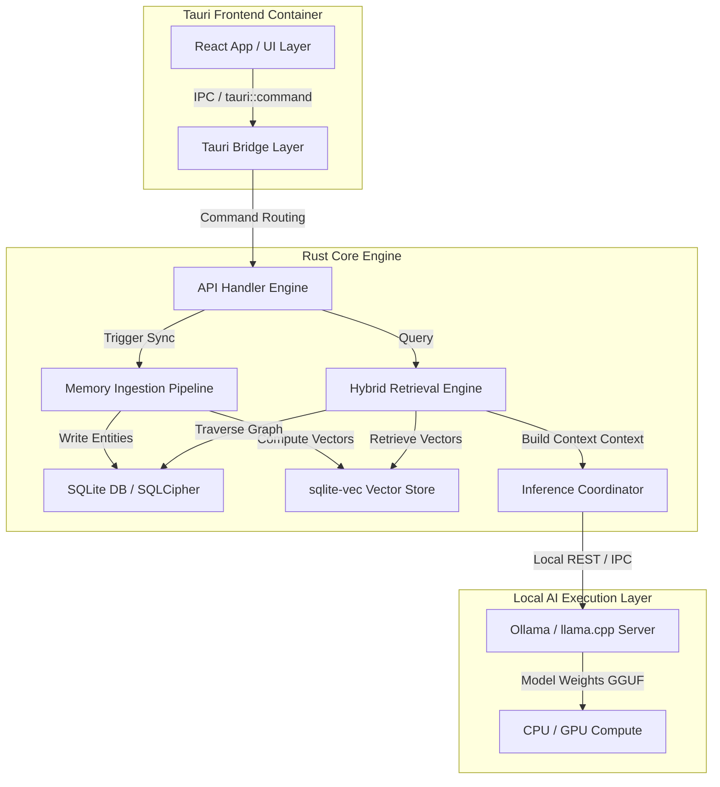
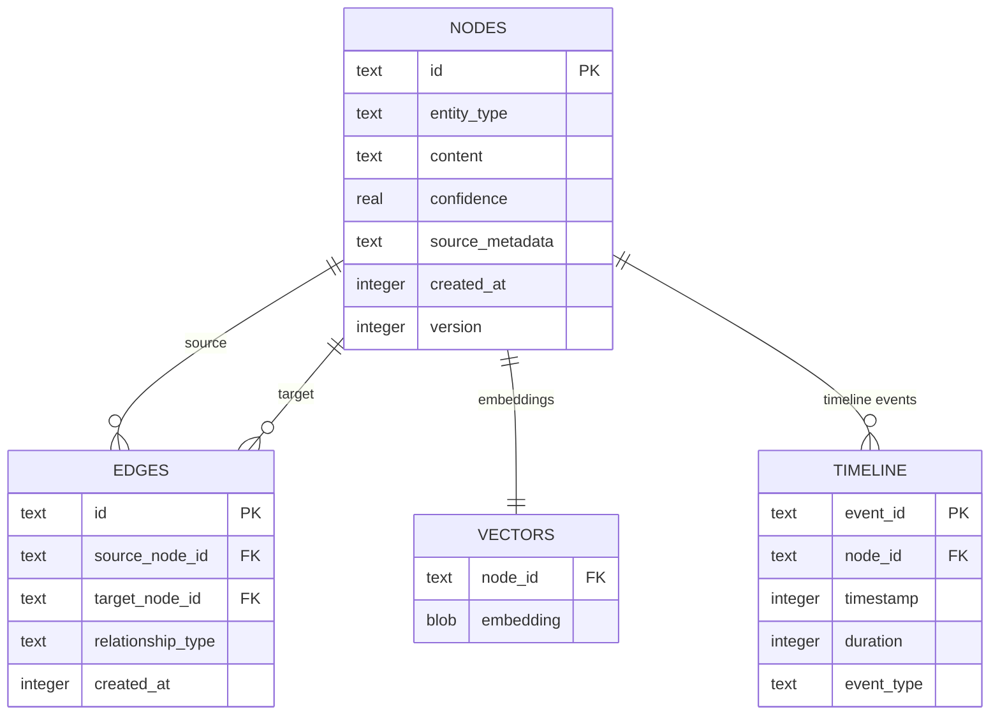

# ATLAS — Technical Requirements Document (TRD)
**Document 3 of 7 · Version 1.0 · Technical Specifications**

---

## 1. High-Level Architecture

Atlas is designed as a desktop application utilizing a **local-first client-core architecture**. It decouples the visual interface from the high-performance local processing, ingestion, and inference systems. 



### 1.1 Core Architecture Decoupling
1.  **Frontend Container (Tauri):** Standard Webview layer utilizing native operating system renderers to keep application memory footprint minimal ($\le 120$ MB idle).
2.  **Core Engine (Rust):** High-speed backend processing raw inputs, managing SQL transactions, performing graph queries, and handling secure filesystem access.
3.  **Inference Server (Ollama / llama.cpp):** Local model server running quantized GGUF weights. Communications occur via a local IPC or REST endpoint (`localhost:11434`), separating LLM execution from application database processes.

---

## 2. Component Specifications

### 2.1 Memory Engine
*   **Role:** Extract raw text chunks from various import directories, perform metadata extraction, and execute normalization.
*   **Pipeline:** 
    *   *Scan Phase:* Directory monitoring using `notify` crate, detecting file additions/modifications.
    *   *Parse Phase:* Specialized extractors parse Markdown headers, PDF texts, Git diff structures, ICS events, and JSON/CSV chat histories.
    *   *Redact Phase:* Identify and replace contact names, email addresses, and phone numbers with local SHA-256 hashes to protect third-party identities.
    *   *Queue Phase:* Stream normalized JSON records to the Database Engine.

### 2.2 Identity Graph
*   **Role:** Store, traverse, and merge relational nodes (entities) and edges (relationships).
*   **Implementation:** Relational database layout mapping nodes and edges (SQL tables: `nodes`, `edges`).
*   **Node Integrity:** Every node contains `entity_type` (e.g. `Decision`, `Skill`), `confidence_score` ($0.0 - 1.0$), `source_metadata` (file path, line range), and a `version_hash` to handle history tracking.
*   **Edge Integrity:** Directed links containing `relationship_type` (e.g. `requires`, `influenced_by`) and `created_at` timestamps.

### 2.3 Timeline Engine
*   **Role:** Maintain chronological indices for all events and version updates.
*   **Chronological Resolution:** Granular indexing supporting precise timestamps down to milliseconds (e.g., chat logs) and general date ranges (e.g., projects spanning quarters).
*   **Version History Linkage:** Evolving entities update their attributes by generating a new version node. The Timeline Engine links the old node to the new node via a `superseded_by` relationship, enabling step-by-step point-in-time state reconstruction.

### 2.4 Local AI Layer
*   **Role:** Host the quantized local models, orchestrate prompts, handle context compression, and stream output tokens.
*   **Inference Pipeline:**
    *   *Model Target:* 7B-8B parameter models (e.g., Llama-3-8B-Instruct, Qwen-2.5-7B-Instruct) quantized to 4-bit (GGUF Q4_K_M).
    *   *Context Management:* 8k token window sliding context buffer. If retrieval contexts exceed limits, the layer runs local recursive summarization to compress facts.
    *   *Compute Target:* GPU execution fallback to CPU threads using AVX2/AVX512 configurations for older x86 systems.

### 2.5 Embedding System
*   **Role:** Convert textual representation of nodes and documents into high-dimensional vector representations.
*   **Model Choice:** `bge-small-en-v1.5` or `all-MiniLM-L6-v2` run locally via the `ort` crate (ONNX Runtime bindings for Rust).
*   **Dimensions:** 384 dimensions to optimize memory footprint and database query times.

### 2.6 Vector Database & Search Engine
*   **Role:** Execute fast K-Nearest Neighbor (KNN) searches.
*   **Implementation:** `sqlite-vec` extension compiled directly into the SQLCipher binary.
*   **Search Pipeline:** Converts user prompt to a 384-dimensional vector, runs Cosine Similarity lookup, extracts top 20 candidate matches, and passes them to the Retrieval Engine.

### 2.7 Retrieval Engine
*   **Role:** Select, score, and rank retrieved records to construct the optimal LLM context prompt.
*   **Hybrid Ranking Algorithm:**
    $$Score = w_1 \cdot \text{VectorScore} + w_2 \cdot \text{GraphScore} - w_3 \cdot \Delta t$$
    *   $\text{VectorScore}$: Semantic distance to the query.
    *   $\text{GraphScore}$: Degree centrality and shortest-path distance to key anchor entities in the active graph cluster.
    *   $\Delta t$: Age of the record, penalizing older nodes unless target query requests historical information.

### 2.8 Reflection Engine
*   **Role:** Run scheduled offline summarization jobs to generate periodic reports and update "Identity DNA" profiles.
*   **Pipeline:**
    *   *Trigger:* Chronological timer fires on system idle state.
    *   *Aggregation:* Gathers all events, decisions, and commit histories from the past week.
    *   *Prompt Ingestion:* Feeds data structures to the local LLM with structured schemas (JSON mode) to extract values, learning patterns, and goal updates.
    *   *Write Back:* Saves output to the `reflections` table and updates `identity_dna` columns.

---

## 3. Technology Stack & Justification

| Layer | Technology | Selected Tool | Justification |
| :--- | :--- | :--- | :--- |
| **Frontend** | Framework | **React + TS** | Industry-standard developer ecosystem, reactive state management for complex UI elements. |
| **Frontend Container** | System | **Tauri (Rust)** | Native OS webview containers bypass heavy Chromium bundlers (Electron), reducing application size and memory footprints. |
| **Backend Core** | Runtime | **Rust** | Guarantees thread safety for indexing jobs, high computational execution speeds, and zero-overhead C-bindings to SQLite. |
| **Database** | SQL Engine | **SQLite** | Zero configuration serverless database file format, transactional stability, and simple client distribution. |
| **Database Encryption** | Security | **SQLCipher** | Integrates at-rest database page encryption directly into SQLite operations, satisfying strict privacy policies. |
| **Vector Index** | Library | **sqlite-vec** | Lightweight, C-based extension for vector search that runs directly inside the SQLite database process. |
| **Local Inference** | Engine | **llama.cpp / Ollama** | Highly optimized C++ inference engine that takes advantage of Apple Metal API, CUDA, and CPU thread sets. |
| **Embeddings** | Library | **ONNX Runtime (Rust ort)** | Run open source embedding models locally inside the Rust process without external process dependencies. |

---

## 4. Database Design (Architectural Concept)

The local data layer represents a unified relational database where structured graph nodes, vector keys, and historical timelines exist inside a single SQLite transaction file.



---

## 5. Security & Encryption Strategy

To prevent third-party access to physical memory dumps or disk storage:
*   **Database Key Derivation:** Master passphrase runs through Argon2id or PBKDF2 with 100,000 rounds. The generated key remains in application RAM memory to authenticate SQLCipher commands.
*   **Memory Protection (Rust):** Important encryption keys are wrapped in memory structures that explicitly wipe their backing allocations upon drop (`secrecy` crate).
*   **Disk Spill Prevention:** Embedding vector indexes are written directly to SQLCipher encrypted blocks. Plaintext temporary files are never generated during parsing or summarization procedures.
*   **Local IPC Security:** Tauri’s IPC commands are strictly type-safe, enforcing input sanitization and verification parameters on all folder path requests.

---

## 6. APIs & Plugin Architecture

Atlas ensures extensibility while maintaining strict local sandboxing:

### 6.1 Sandboxed Import API
*   Plugins are executed as sandboxed WebAssembly (Wasm) modules using the `wasmtime` engine.
*   **Restrictions:**
    *   Wasm modules have **zero network access**.
    *   Wasm modules can only read files within a single, user-approved subdirectory path (using WASI sandboxed filesystem handles).
    *   Modules communicate with the Rust core via standard input/output channels, outputting a defined JSON parser schema:

```json
{
  "protocol_version": 1,
  "extracted_entities": [
    {
      "entity_type": "Project",
      "name": "Verdict AI",
      "timestamp": 1718000000,
      "metadata": {
        "source": "github_importer",
        "raw_path": "/user/projects/verdict"
      }
    }
  ]
}
```

---

## 7. Operational Strategies & Engineering Guidelines

### 7.1 Folder Structure

```
atlas-workspace/
├── src-tauri/                 # Tauri Backend Engine (Rust Core)
│   ├── src/
│   │   ├── api/               # Tauri IPC commands & API controllers
│   │   ├── database/          # SQLCipher & sqlite-vec transaction engine
│   │   ├── ingestion/         # Ingestion pipes, markdown & PDF parsers
│   │   ├── inference/         # Ollama IPC & LLM orchestration
│   │   ├── models/            # Schema declarations
│   │   └── main.rs            # Core entry point
│   ├── Cargo.toml
│   └── tauri.conf.json
├── src/                       # Tauri Frontend Application (React + TS)
│   ├── components/            # Reusable UI layout elements
│   ├── hooks/                 # Tauri command IPC state hooks
│   ├── pages/                 # Dashboard, Timeline, Graph Canvas
│   ├── styles/                # CSS themes & glassmorphic layouts
│   └── App.tsx
└── plugins/                   # Sandboxed importer scripts (Wasm source)
```

### 7.2 Engineering Principles & Coding Standards
*   **Rust Memory Safe Rules:** Avoid unsafe code blocks (`unsafe {}`) unless interacting with C-libraries like SQLite.
*   **Error Handling:** Use custom Rust Error Enums (`thiserror` crate) mapping back to type-safe frontend JSON error objects.
*   **Thread Isolation:** CPU-bound jobs (embedding computation, ingestion indexing) must execute on dedicated backend workers (`tokio::task::spawn_blocking`), preserving main thread UI performance.
*   **CI/CD Pipeline:** GitHub Actions compile native binaries for Windows, macOS (universal apple/intel binaries), and Linux, running automatic tests on every main branch merge.

---

## 8. Deployment & Disaster Recovery

*   **Distribution:** Single installer package containing the Tauri app wrapper and required local ONNX runtime embedding libraries. Quantized LLM models are downloaded on user request during setup.
*   **Disaster Recovery:** Databases undergo transactional journal-write checkmarks. Backups are exported as single encrypted `.atlas` archives containing the full SQLCipher DB dump.
*   **Future Scaling:** The database schema supports horizontal schema evolution. Migration operations run sequentially via a local migration manager on app startup.
