# ATLAS — Database Design Document
**Document 4 of 7 · Version 1.0 · Technical Specifications**

---

## 1. Unified Entity-Relationship (ER) Diagram

```mermaid
erDiagram
  nodes ||--o{ edges : "source"
  nodes ||--o{ edges : "target"
  nodes ||--|| embeddings : "has"
  nodes ||--o{ timeline_events : "places on"
  nodes ||--o{ source_references : "derived from"
  
  nodes ||--o| memories : "extends"
  nodes ||--o| projects : "extends"
  nodes ||--o| goals : "extends"
  nodes ||--o| habits : "extends"
  nodes ||--o| skills : "extends"
  nodes ||--o| beliefs : "extends"
  nodes ||--o| decisions : "extends"
  nodes ||--o| people : "extends"
  nodes ||--o| organizations : "extends"
  nodes ||--o| places : "extends"
  nodes ||--o| documents : "extends"
  nodes ||--o| notes : "extends"
  nodes ||--o| media_assets : "extends"
  nodes ||--o| chats : "extends"
  nodes ||--o| calendar_events : "extends"
  nodes ||--o| knowledge_nodes : "extends"

  import_sessions ||--o{ source_references : "tracks"
  ai_conversations ||--o{ ai_sessions : "contains"
  ai_sessions ||--o{ activity_logs : "logs to"
```



---

## 2. Table Specifications

### 2.1 Core Identity Graph Tables

#### Table: `nodes`
*   **Purpose:** Base table representing every entity in the Identity Graph.
*   **Normalization:** 3NF base mapping.
*   **Optimization:** Covered by a composite index on `(entity_type, is_current)`.

| Field Name | Type | Key | Constraints | Description |
| :--- | :--- | :--- | :--- | :--- |
| `id` | TEXT | PK | NOT NULL | UUIDv4 identifier. |
| `entity_type` | TEXT | | NOT NULL | e.g. 'Project', 'Decision', 'Belief'. |
| `name` | TEXT | | NOT NULL | Primary display name. |
| `content` | TEXT | | | Detailed text descriptions or body. |
| `confidence` | REAL | | CHECK(confidence BETWEEN 0.0 AND 1.0) | Extraction confidence score. |
| `created_at` | INTEGER | | NOT NULL | Unix epoch timestamp (ms). |
| `version` | INTEGER | | NOT NULL DEFAULT 1 | Evolving count. |
| `is_current` | INTEGER | | NOT NULL CHECK(is_current IN (0,1)) | Flag indicating latest version. |
| `parent_version_id` | TEXT | FK | REFERENCES nodes(id) | Self-link for version tracking. |

#### Table: `edges`
*   **Purpose:** Represents directed relationships between entities in the graph.
*   **Normalization:** 3NF.
*   **Optimization:** Foreign key indexes on `source_node_id` and `target_node_id`.

| Field Name | Type | Key | Constraints | Description |
| :--- | :--- | :--- | :--- | :--- |
| `id` | TEXT | PK | NOT NULL | UUIDv4. |
| `source_node_id` | TEXT | FK | NOT NULL REFERENCES nodes(id) ON DELETE CASCADE | Source entity. |
| `target_node_id` | TEXT | FK | NOT NULL REFERENCES nodes(id) ON DELETE CASCADE | Target entity. |
| `relationship_type`| TEXT | | NOT NULL | e.g. 'REQUIRES', 'INFLUENCED_BY'. |
| `created_at` | INTEGER | | NOT NULL | Unix epoch (ms). |

---

### 2.2 Domain Entity Extension Tables

#### Table: `memories`
*   **Purpose:** Personal diary entries, moments, and episodic memories.

| Field Name | Type | Key | Constraints | Description |
| :--- | :--- | :--- | :--- | :--- |
| `node_id` | TEXT | PK, FK | REFERENCES nodes(id) ON DELETE CASCADE | Base link. |
| `emotional_valence`| REAL | | CHECK(emotional_valence BETWEEN -1.0 AND 1.0) | Sentiment rating. |
| `significance` | REAL | | DEFAULT 0.5 | Signify rating. |

#### Table: `projects`
*   **Purpose:** Tracks software, writing, or building projects.

| Field Name | Type | Key | Constraints | Description |
| :--- | :--- | :--- | :--- | :--- |
| `node_id` | TEXT | PK, FK | REFERENCES nodes(id) ON DELETE CASCADE | Base link. |
| `status` | TEXT | | CHECK(status IN ('IDEATION','ACTIVE','COMPLETED','ARCHIVED')) | Project state. |
| `repository_url` | TEXT | | | Optional link path. |

#### Table: `goals`
*   **Purpose:** Tracks explicit aspirations.

| Field Name | Type | Key | Constraints | Description |
| :--- | :--- | :--- | :--- | :--- |
| `node_id` | TEXT | PK, FK | REFERENCES nodes(id) ON DELETE CASCADE | Base link. |
| `target_date` | INTEGER | | | Target resolution epoch. |
| `status` | TEXT | | CHECK(status IN ('ACTIVE','MET','ABANDONED')) | Goal status. |

#### Table: `habits`
*   **Purpose:** Tracks recurring behaviors and routines.

| Field Name | Type | Key | Constraints | Description |
| :--- | :--- | :--- | :--- | :--- |
| `node_id` | TEXT | PK, FK | REFERENCES nodes(id) ON DELETE CASCADE | Base link. |
| `frequency_target` | INTEGER | | NOT NULL | Targeted completions per week. |
| `is_automated` | INTEGER | | CHECK(is_automated IN (0,1)) | System inferred vs manually set. |

#### Table: `skills`
*   **Purpose:** Technologies, concepts, and capabilities mastered.

| Field Name | Type | Key | Constraints | Description |
| :--- | :--- | :--- | :--- | :--- |
| `node_id` | TEXT | PK, FK | REFERENCES nodes(id) ON DELETE CASCADE | Base link. |
| `proficiency_level`| TEXT | | CHECK(proficiency_level IN ('BEGINNER','INTERMEDIATE','EXPERT')) | Inferred scale. |

#### Table: `beliefs`
*   **Purpose:** Stated opinions, values, and philosophies.

| Field Name | Type | Key | Constraints | Description |
| :--- | :--- | :--- | :--- | :--- |
| `node_id` | TEXT | PK, FK | REFERENCES nodes(id) ON DELETE CASCADE | Base link. |
| `stability_index` | REAL | | DEFAULT 0.5 | Resilience to change. |

#### Table: `decisions`
*   **Purpose:** Critical architectural, career, or personal pivots.

| Field Name | Type | Key | Constraints | Description |
| :--- | :--- | :--- | :--- | :--- |
| `node_id` | TEXT | PK, FK | REFERENCES nodes(id) ON DELETE CASCADE | Base link. |
| `alternatives_considered`| TEXT | | | JSON array text representation. |
| `rationale` | TEXT | | NOT NULL | Reason behind choice. |

#### Table: `people`
*   **Purpose:** Profiles of contacts and digital connections.

| Field Name | Type | Key | Constraints | Description |
| :--- | :--- | :--- | :--- | :--- |
| `node_id` | TEXT | PK, FK | REFERENCES nodes(id) ON DELETE CASCADE | Base link. |
| `anonymized_hash` | TEXT | | UNIQUE | Hashed identifier for privacy. |
| `relationship_strength`| REAL | | DEFAULT 0.0 | Frequency score. |

#### Table: `organizations`
*   **Purpose:** Employers, academic institutions, or clients.

| Field Name | Type | Key | Constraints | Description |
| :--- | :--- | :--- | :--- | :--- |
| `node_id` | TEXT | PK, FK | REFERENCES nodes(id) ON DELETE CASCADE | Base link. |
| `domain` | TEXT | | | e.g. 'academia', 'corporate'. |

#### Table: `places`
*   **Purpose:** Physical locations visited.

| Field Name | Type | Key | Constraints | Description |
| :--- | :--- | :--- | :--- | :--- |
| `node_id` | TEXT | PK, FK | REFERENCES nodes(id) ON DELETE CASCADE | Base link. |
| `latitude` | REAL | | | Geographic coordination. |
| `longitude` | REAL | | | Geographic coordination. |

#### Table: `documents`
*   **Purpose:** Local PDF files, spreadsheets, or long files.

| Field Name | Type | Key | Constraints | Description |
| :--- | :--- | :--- | :--- | :--- |
| `node_id` | TEXT | PK, FK | REFERENCES nodes(id) ON DELETE CASCADE | Base link. |
| `checksum` | TEXT | | UNIQUE | File integrity hash. |
| `author_list` | TEXT | | | Authors text mapping. |

#### Table: `notes`
*   **Purpose:** Markdown and journal notes.

| Field Name | Type | Key | Constraints | Description |
| :--- | :--- | :--- | :--- | :--- |
| `node_id` | TEXT | PK, FK | REFERENCES nodes(id) ON DELETE CASCADE | Base link. |
| `frontmatter_json` | TEXT | | | YAML frontmatter serialized. |

#### Table: `media_assets`
*   **Purpose:** Images, audio files, and video records.

| Field Name | Type | Key | Constraints | Description |
| :--- | :--- | :--- | :--- | :--- |
| `node_id` | TEXT | PK, FK | REFERENCES nodes(id) ON DELETE CASCADE | Base link. |
| `media_type` | TEXT | | CHECK(media_type IN ('IMAGE','VIDEO','AUDIO')) | Classification. |
| `ocr_transcript` | TEXT | | | Extracted text content. |

#### Table: `chats`
*   **Purpose:** Private message archives (WhatsApp/Telegram/Slack).

| Field Name | Type | Key | Constraints | Description |
| :--- | :--- | :--- | :--- | :--- |
| `node_id` | TEXT | PK, FK | REFERENCES nodes(id) ON DELETE CASCADE | Base link. |
| `message_count` | INTEGER | | DEFAULT 0 | Count of active rows. |

#### Table: `calendar_events`
*   **Purpose:** Scheduled events.

| Field Name | Type | Key | Constraints | Description |
| :--- | :--- | :--- | :--- | :--- |
| `node_id` | TEXT | PK, FK | REFERENCES nodes(id) ON DELETE CASCADE | Base link. |
| `location_text` | TEXT | | | Event location description. |

#### Table: `knowledge_nodes`
*   **Purpose:** Theories, documentation, and conceptual schemas.

| Field Name | Type | Key | Constraints | Description |
| :--- | :--- | :--- | :--- | :--- |
| `node_id` | TEXT | PK, FK | REFERENCES nodes(id) ON DELETE CASCADE | Base link. |
| `provenance_trail` | TEXT | | | Origin history path details. |

---

### 2.3 Timeline & Context Tables

#### Table: `timeline_events`
*   **Purpose:** Main index for chronological lookups.

| Field Name | Type | Key | Constraints | Description |
| :--- | :--- | :--- | :--- | :--- |
| `id` | TEXT | PK | NOT NULL | UUIDv4. |
| `node_id` | TEXT | FK | NOT NULL REFERENCES nodes(id) ON DELETE CASCADE | Associated node. |
| `timestamp` | INTEGER | | NOT NULL | Event epoch (ms). |
| `duration` | INTEGER | | DEFAULT 0 | Optional duration span (ms). |
| `event_type` | TEXT | | NOT NULL | Class (e.g. 'COMMIT', 'MEETING'). |

#### Table: `embeddings`
*   **Purpose:** Storage of semantic vector states linked to the graph.

| Field Name | Type | Key | Constraints | Description |
| :--- | :--- | :--- | :--- | :--- |
| `node_id` | TEXT | PK, FK | REFERENCES nodes(id) ON DELETE CASCADE | Target link. |
| `embedding` | F32_BLOB| | NOT NULL | 384-dimension binary float array. |

---

### 2.4 Session, Configuration, & Ingestion Tables

#### Table: `import_sessions`
*   **Purpose:** Logs historical ingestion operations.

| Field Name | Type | Key | Constraints | Description |
| :--- | :--- | :--- | :--- | :--- |
| `id` | TEXT | PK | NOT NULL | UUIDv4. |
| `started_at` | INTEGER | | NOT NULL | Start epoch. |
| `ended_at` | INTEGER | | | Completion epoch. |
| `status` | TEXT | | CHECK(status IN ('RUNNING','SUCCESS','FAILED')) | Sync state. |
| `files_parsed` | INTEGER | | DEFAULT 0 | Total count. |

#### Table: `source_references`
*   **Purpose:** Traces the physical provenance of a node back to a file.

| Field Name | Type | Key | Constraints | Description |
| :--- | :--- | :--- | :--- | :--- |
| `id` | TEXT | PK | NOT NULL | UUIDv4. |
| `node_id` | TEXT | FK | NOT NULL REFERENCES nodes(id) ON DELETE CASCADE | Derived node. |
| `import_session_id`| TEXT | FK | REFERENCES import_sessions(id) | Sync session context. |
| `file_path` | TEXT | | NOT NULL | Local path representation. |
| `line_start` | INTEGER | | | Starting line indicator. |
| `line_end` | INTEGER | | | Ending line indicator. |

#### Table: `ai_conversations`
*   **Purpose:** Grouping user-AI message threads.

| Field Name | Type | Key | Constraints | Description |
| :--- | :--- | :--- | :--- | :--- |
| `id` | TEXT | PK | NOT NULL | UUIDv4. |
| `title` | TEXT | | DEFAULT 'New Conversation' | Thread title. |
| `created_at` | INTEGER | | NOT NULL | Epoch value. |

#### Table: `ai_sessions`
*   **Purpose:** Tracks messages, query configurations, and parameters.

| Field Name | Type | Key | Constraints | Description |
| :--- | :--- | :--- | :--- | :--- |
| `id` | TEXT | PK | NOT NULL | UUIDv4. |
| `conversation_id` | TEXT | FK | NOT NULL REFERENCES ai_conversations(id) ON DELETE CASCADE | Associated thread. |
| `role` | TEXT | | CHECK(role IN ('USER','ASSISTANT')) | Message origin. |
| `message` | TEXT | | NOT NULL | Plaintext body. |
| `citations` | TEXT | | | JSON array referencing nodes. |
| `timestamp` | INTEGER | | NOT NULL | Epoch. |

#### Table: `reflections`
*   **Purpose:** Automated reviews generated by the reflection engine.

| Field Name | Type | Key | Constraints | Description |
| :--- | :--- | :--- | :--- | :--- |
| `id` | TEXT | PK | NOT NULL | UUIDv4. |
| `reflection_type` | TEXT | | CHECK(reflection_type IN ('WEEKLY','MONTHLY','YEARLY')) | Interval. |
| `summary` | TEXT | | NOT NULL | LLM generated reflection text. |
| `created_at` | INTEGER | | NOT NULL | Epoch. |

#### Table: `identity_dna`
*   **Purpose:** Living behavioral traits and styles.

| Field Name | Type | Key | Constraints | Description |
| :--- | :--- | :--- | :--- | :--- |
| `id` | TEXT | PK | NOT NULL | UUIDv4. |
| `trait_name` | TEXT | | UNIQUE NOT NULL | e.g. 'Core Values', 'Risk Tolerance'. |
| `trait_value` | TEXT | | NOT NULL | Current status rating representation. |
| `confidence` | REAL | | DEFAULT 0.0 | Math rating. |
| `updated_at` | INTEGER | | NOT NULL | Epoch. |

#### Table: `pattern_reports`
*   **Purpose:** Surfaced behavioral logs.

| Field Name | Type | Key | Constraints | Description |
| :--- | :--- | :--- | :--- | :--- |
| `id` | TEXT | PK | NOT NULL | UUIDv4. |
| `pattern_description`| TEXT| | NOT NULL | Surfaced explanation text. |
| `is_accepted` | INTEGER | | CHECK(is_accepted IN (0,1)) | User accepted indicator. |
| `created_at` | INTEGER | | NOT NULL | Epoch. |

#### Table: `activity_logs`
*   **Purpose:** Secure audit tracker.

| Field Name | Type | Key | Constraints | Description |
| :--- | :--- | :--- | :--- | :--- |
| `id` | TEXT | PK | NOT NULL | UUIDv4. |
| `action_name` | TEXT | | NOT NULL | Action (e.g. 'QUERY', 'DELETE_NODE'). |
| `executed_at` | INTEGER | | NOT NULL | Epoch. |

---

## 3. SQL Schema (DDL)

```sql
-- Core Graph Schema definitions
CREATE TABLE IF NOT EXISTS nodes (
    id TEXT PRIMARY KEY NOT NULL,
    entity_type TEXT NOT NULL,
    name TEXT NOT NULL,
    content TEXT,
    confidence REAL CHECK(confidence BETWEEN 0.0 AND 1.0),
    created_at INTEGER NOT NULL,
    version INTEGER NOT NULL DEFAULT 1,
    is_current INTEGER NOT NULL CHECK(is_current IN (0,1)),
    parent_version_id TEXT,
    FOREIGN KEY(parent_version_id) REFERENCES nodes(id)
);

CREATE TABLE IF NOT EXISTS edges (
    id TEXT PRIMARY KEY NOT NULL,
    source_node_id TEXT NOT NULL,
    target_node_id TEXT NOT NULL,
    relationship_type TEXT NOT NULL,
    created_at INTEGER NOT NULL,
    FOREIGN KEY(source_node_id) REFERENCES nodes(id) ON DELETE CASCADE,
    FOREIGN KEY(target_node_id) REFERENCES nodes(id) ON DELETE CASCADE
);

-- Sub-entity extension tables
CREATE TABLE IF NOT EXISTS memories (
    node_id TEXT PRIMARY KEY REFERENCES nodes(id) ON DELETE CASCADE,
    emotional_valence REAL CHECK(emotional_valence BETWEEN -1.0 AND 1.0),
    significance REAL DEFAULT 0.5
);

CREATE TABLE IF NOT EXISTS projects (
    node_id TEXT PRIMARY KEY REFERENCES nodes(id) ON DELETE CASCADE,
    status TEXT CHECK(status IN ('IDEATION','ACTIVE','COMPLETED','ARCHIVED')),
    repository_url TEXT
);

CREATE TABLE IF NOT EXISTS goals (
    node_id TEXT PRIMARY KEY REFERENCES nodes(id) ON DELETE CASCADE,
    target_date INTEGER,
    status TEXT CHECK(status IN ('ACTIVE','MET','ABANDONED'))
);

CREATE TABLE IF NOT EXISTS habits (
    node_id TEXT PRIMARY KEY REFERENCES nodes(id) ON DELETE CASCADE,
    frequency_target INTEGER NOT NULL,
    is_automated INTEGER CHECK(is_automated IN (0,1))
);

CREATE TABLE IF NOT EXISTS skills (
    node_id TEXT PRIMARY KEY REFERENCES nodes(id) ON DELETE CASCADE,
    proficiency_level TEXT CHECK(proficiency_level IN ('BEGINNER','INTERMEDIATE','EXPERT'))
);

CREATE TABLE IF NOT EXISTS beliefs (
    node_id TEXT PRIMARY KEY REFERENCES nodes(id) ON DELETE CASCADE,
    stability_index REAL DEFAULT 0.5
);

CREATE TABLE IF NOT EXISTS decisions (
    node_id TEXT PRIMARY KEY REFERENCES nodes(id) ON DELETE CASCADE,
    alternatives_considered TEXT,
    rationale TEXT NOT NULL
);

CREATE TABLE IF NOT EXISTS people (
    node_id TEXT PRIMARY KEY REFERENCES nodes(id) ON DELETE CASCADE,
    anonymized_hash TEXT UNIQUE,
    relationship_strength REAL DEFAULT 0.0
);

CREATE TABLE IF NOT EXISTS organizations (
    node_id TEXT PRIMARY KEY REFERENCES nodes(id) ON DELETE CASCADE,
    domain TEXT
);

CREATE TABLE IF NOT EXISTS places (
    node_id TEXT PRIMARY KEY REFERENCES nodes(id) ON DELETE CASCADE,
    latitude REAL,
    longitude REAL
);

CREATE TABLE IF NOT EXISTS documents (
    node_id TEXT PRIMARY KEY REFERENCES nodes(id) ON DELETE CASCADE,
    checksum TEXT UNIQUE,
    author_list TEXT
);

CREATE TABLE IF NOT EXISTS notes (
    node_id TEXT PRIMARY KEY REFERENCES nodes(id) ON DELETE CASCADE,
    frontmatter_json TEXT
);

CREATE TABLE IF NOT EXISTS media_assets (
    node_id TEXT PRIMARY KEY REFERENCES nodes(id) ON DELETE CASCADE,
    media_type TEXT CHECK(media_type IN ('IMAGE','VIDEO','AUDIO')),
    ocr_transcript TEXT
);

CREATE TABLE IF NOT EXISTS chats (
    node_id TEXT PRIMARY KEY REFERENCES nodes(id) ON DELETE CASCADE,
    message_count INTEGER DEFAULT 0
);

CREATE TABLE IF NOT EXISTS calendar_events (
    node_id TEXT PRIMARY KEY REFERENCES nodes(id) ON DELETE CASCADE,
    location_text TEXT
);

CREATE TABLE IF NOT EXISTS knowledge_nodes (
    node_id TEXT PRIMARY KEY REFERENCES nodes(id) ON DELETE CASCADE,
    provenance_trail TEXT
);

-- Chronology tables
CREATE TABLE IF NOT EXISTS timeline_events (
    id TEXT PRIMARY KEY NOT NULL,
    node_id TEXT NOT NULL,
    timestamp INTEGER NOT NULL,
    duration INTEGER DEFAULT 0,
    event_type TEXT NOT NULL,
    FOREIGN KEY(node_id) REFERENCES nodes(id) ON DELETE CASCADE
);

-- Session, configuration & audit trails
CREATE TABLE IF NOT EXISTS import_sessions (
    id TEXT PRIMARY KEY NOT NULL,
    started_at INTEGER NOT NULL,
    ended_at INTEGER,
    status TEXT CHECK(status IN ('RUNNING','SUCCESS','FAILED')),
    files_parsed INTEGER DEFAULT 0
);

CREATE TABLE IF NOT EXISTS source_references (
    id TEXT PRIMARY KEY NOT NULL,
    node_id TEXT NOT NULL,
    import_session_id TEXT,
    file_path TEXT NOT NULL,
    line_start INTEGER,
    line_end INTEGER,
    FOREIGN KEY(node_id) REFERENCES nodes(id) ON DELETE CASCADE,
    FOREIGN KEY(import_session_id) REFERENCES import_sessions(id)
);

CREATE TABLE IF NOT EXISTS ai_conversations (
    id TEXT PRIMARY KEY NOT NULL,
    title TEXT DEFAULT 'New Conversation',
    created_at INTEGER NOT NULL
);

CREATE TABLE IF NOT EXISTS ai_sessions (
    id TEXT PRIMARY KEY NOT NULL,
    conversation_id TEXT NOT NULL,
    role TEXT CHECK(role IN ('USER','ASSISTANT')),
    message TEXT NOT NULL,
    citations TEXT,
    timestamp INTEGER NOT NULL,
    FOREIGN KEY(conversation_id) REFERENCES ai_conversations(id) ON DELETE CASCADE
);

CREATE TABLE IF NOT EXISTS reflections (
    id TEXT PRIMARY KEY NOT NULL,
    reflection_type TEXT CHECK(reflection_type IN ('WEEKLY','MONTHLY','YEARLY')),
    summary TEXT NOT NULL,
    created_at INTEGER NOT NULL
);

CREATE TABLE IF NOT EXISTS identity_dna (
    id TEXT PRIMARY KEY NOT NULL,
    trait_name TEXT UNIQUE NOT NULL,
    trait_value TEXT NOT NULL,
    confidence REAL DEFAULT 0.0,
    updated_at INTEGER NOT NULL
);

CREATE TABLE IF NOT EXISTS pattern_reports (
    id TEXT PRIMARY KEY NOT NULL,
    pattern_description TEXT NOT NULL,
    is_accepted INTEGER CHECK(is_accepted IN (0,1)),
    created_at INTEGER NOT NULL
);

CREATE TABLE IF NOT EXISTS activity_logs (
    id TEXT PRIMARY KEY NOT NULL,
    action_name TEXT NOT NULL,
    executed_at INTEGER NOT NULL
);

-- Virtual Vector Table (sqlite-vec module configuration)
CREATE VIRTUAL TABLE IF NOT EXISTS vec_embeddings USING vec0(
    node_id TEXT PRIMARY KEY,
    embedding float[384]
);

-- Optimization Indices
CREATE INDEX IF NOT EXISTS idx_nodes_type_current ON nodes(entity_type, is_current);
CREATE INDEX IF NOT EXISTS idx_edges_source ON edges(source_node_id);
CREATE INDEX IF NOT EXISTS idx_edges_target ON edges(target_node_id);
CREATE INDEX IF NOT EXISTS idx_timeline_timestamp ON timeline_events(timestamp);
CREATE INDEX IF NOT EXISTS idx_source_node ON source_references(node_id);
CREATE INDEX IF NOT EXISTS idx_ai_messages ON ai_sessions(conversation_id, timestamp);
```

---

## 4. Prisma Schema

```prisma
datasource db {
  provider = "sqlite"
  url      = "file:./dev.db"
}

generator client {
  provider = "prisma-client-js"
}

model Node {
  id                String            @id @default(uuid())
  entityType        String
  name              String
  content           String?
  confidence        Float?
  createdAt         Int
  version           Int               @default(1)
  isCurrent         Int
  parentVersionId   String?
  parentVersion     Node?             @relation("NodeVersions", fields: [parentVersionId], references: [id], onDelete: NoAction, onUpdate: NoAction)
  childVersions     Node[]            @relation("NodeVersions")
  
  sourceEdges       Edge[]            @relation("SourceEdges")
  targetEdges       Edge[]            @relation("TargetEdges")
  timelineEvents    TimelineEvent[]
  sourceReferences  SourceReference[]

  memory            Memory?
  project           Project?
  goal              Goal?
  habit             Habit?
  skill             Skill?
  belief            Belief?
  decision          Decision?
  person            Person?
  organization      Organization?
  place             Place?
  document          Document?
  note              Note?
  mediaAsset        MediaAsset?
  chat              Chat?
  calendarEvent     CalendarEvent?
  knowledgeNode     KnowledgeNode?

  @@index([entityType, isCurrent])
}

model Edge {
  id               String   @id @default(uuid())
  sourceNodeId     String
  targetNodeId     String
  relationshipType String
  createdAt        Int
  
  sourceNode       Node     @relation("SourceEdges", fields: [sourceNodeId], references: [id], onDelete: Cascade)
  targetNode       Node     @relation("TargetEdges", fields: [targetNodeId], references: [id], onDelete: Cascade)

  @@index([sourceNodeId])
  @@index([targetNodeId])
}

model Memory {
  nodeId           String   @id
  emotionalValence Float?
  significance     Float    @default(0.5)
  node             Node     @relation(fields: [nodeId], references: [id], onDelete: Cascade)
}

model Project {
  nodeId         String   @id
  status         String?
  repositoryUrl  String?
  node           Node     @relation(fields: [nodeId], references: [id], onDelete: Cascade)
}

model Goal {
  nodeId     String   @id
  targetDate Int?
  status     String?
  node       Node     @relation(fields: [nodeId], references: [id], onDelete: Cascade)
}

model Habit {
  nodeId          String   @id
  frequencyTarget Int
  isAutomated     Int
  node            Node     @relation(fields: [nodeId], references: [id], onDelete: Cascade)
}

model Skill {
  nodeId           String   @id
  proficiencyLevel String?
  node             Node     @relation(fields: [nodeId], references: [id], onDelete: Cascade)
}

model Belief {
  nodeId         String   @id
  stabilityIndex Float    @default(0.5)
  node           Node     @relation(fields: [nodeId], references: [id], onDelete: Cascade)
}

model Decision {
  nodeId                 String   @id
  alternativesConsidered String?
  rationale              String
  node                   Node     @relation(fields: [nodeId], references: [id], onDelete: Cascade)
}

model Person {
  nodeId               String   @id
  anonymizedHash       String?  @unique
  relationshipStrength Float    @default(0.0)
  node                 Node     @relation(fields: [nodeId], references: [id], onDelete: Cascade)
}

model Organization {
  nodeId String  @id
  domain String?
  node   Node    @relation(fields: [nodeId], references: [id], onDelete: Cascade)
}

model Place {
  nodeId    String @id
  latitude  Float?
  longitude Float?
  node      Node   @relation(fields: [nodeId], references: [id], onDelete: Cascade)
}

model Document {
  nodeId     String  @id
  checksum   String? @unique
  authorList String?
  node       Node    @relation(fields: [nodeId], references: [id], onDelete: Cascade)
}

model Note {
  nodeId          String  @id
  frontmatterJson String?
  node            Node    @relation(fields: [nodeId], references: [id], onDelete: Cascade)
}

model MediaAsset {
  nodeId        String  @id
  mediaType     String
  ocrTranscript String?
  node          Node    @relation(fields: [nodeId], references: [id], onDelete: Cascade)
}

model Chat {
  nodeId       String @id
  messageCount Int    @default(0)
  node         Node   @relation(fields: [nodeId], references: [id], onDelete: Cascade)
}

model CalendarEvent {
  nodeId       String  @id
  locationText String?
  node         Node    @relation(fields: [nodeId], references: [id], onDelete: Cascade)
}

model KnowledgeNode {
  nodeId          String  @id
  provenanceTrail String?
  node            Node    @relation(fields: [nodeId], references: [id], onDelete: Cascade)
}

model TimelineEvent {
  id        String @id @default(uuid())
  nodeId    String
  timestamp Int
  duration  Int    @default(0)
  eventType String
  node      Node   @relation(fields: [nodeId], references: [id], onDelete: Cascade)

  @@index([timestamp])
}

model ImportSession {
  id               String            @id @default(uuid())
  startedAt        Int
  endedAt          Int?
  status           String?
  filesParsed      Int               @default(0)
  sourceReferences SourceReference[]
}

model SourceReference {
  id              String         @id @default(uuid())
  nodeId          String
  importSessionId String?
  filePath        String
  lineStart       Int?
  lineEnd         Int?
  
  node            Node           @relation(fields: [nodeId], references: [id], onDelete: Cascade)
  importSession   ImportSession? @relation(fields: [importSessionId], references: [id])

  @@index([nodeId])
}

model AiConversation {
  id        String      @id @default(uuid())
  title     String      @default("New Conversation")
  createdAt Int
  sessions  AiSession[]
}

model AiSession {
  id             String         @id @default(uuid())
  conversationId String
  role           String
  message        String
  citations      String?
  timestamp      Int
  conversation   AiConversation @relation(fields: [conversationId], references: [id], onDelete: Cascade)

  @@index([conversationId, timestamp])
}

model Reflection {
  id             String @id @default(uuid())
  reflectionType String
  summary        String
  createdAt      Int
}

model IdentityDna {
  id         String @id @default(uuid())
  traitName  String @unique
  traitValue String
  confidence Float  @default(0.0)
  updatedAt  Int
}

model PatternReport {
  id                 String @id @default(uuid())
  patternDescription String
  isAccepted         Int
  createdAt          Int
}

model ActivityLog {
  id         String @id @default(uuid())
  actionName String
  executedAt Int
}
```

---

## 5. Performance Optimization & Normalization Strategy

*   **Normalization Level:** Selected entities inherit baseline characteristics from the unified `nodes` schema (Generalization-Specialization pattern). This avoids duplication of structural elements (e.g. name, timestamps, tags, confidence indicators) while keeping specific properties inside dedicated extension sheets.
*   **Indices Optimization:** Composite index on `(entity_type, is_current)` avoids slow multi-version comparisons. Explicit indexing of timestamps on the `timeline_events` table ensures fast Horizontal Timeline zoom operations.
*   **Vector Query Speed:** By utilizing the compiled virtual module `vec_embeddings`, vector matching bypasses application-level iterations and performs KNN arithmetic directly in SQLite thread memory.
*   **VACUUM Scheduling:** A background maintenance cron triggers SQLite `VACUUM` and `ANALYZE` commands when the desktop app is idle, optimizing DB indexing structures weekly.
