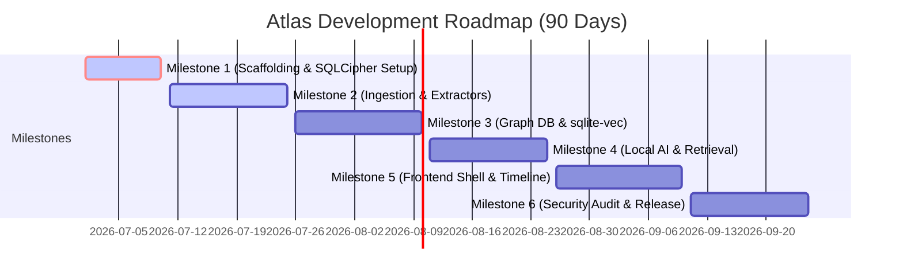

# ATLAS — Implementation Plan Document
**Document 6 of 7 · Version 1.0 · Project Roadmap**

---

## 1. Phased Milestones

The development of Atlas is structured across six main sequential milestones, prioritizing base infrastructure and security before layer enhancements and interface visualizers.

### 1.1 Milestone 1: Core Scaffolding & Encryption Setup
*   **Objective:** Initialize the Tauri + Rust environment, establish local file permissions, and configure at-rest database encryption.
*   **Deliverables:** Tauri core wrapper, base Rust directories, encrypted SQLCipher base schema.
*   **Tasks:**
    1.  Initialize Tauri desktop application package with React/TypeScript frontend templates.
    2.  Configure Rust backend Cargo environment including dependencies (`sqlx`, `sqlcipher`, `secrecy`, `notify`).
    3.  Implement master password PBKDF2 key derivation pipeline.
    4.  Configure database connection initialization script utilizing SQLCipher page-level encryption.
*   **Dependencies:** None.
*   **Estimated Duration:** 10 Days.
*   **Difficulty:** Medium.
*   **Priority:** Critical.
*   **Testing Strategy:** Unit tests verifying SQLCipher database decryption failure on incorrect keys and successful data writes on authenticated runs.
*   **Expected Output:** Authenticated Tauri console loading successfully and generating an encrypted SQLite database on disk.

### 1.2 Milestone 2: Memory Ingestion & Document Extractor Engines
*   **Objective:** Build local filesystem crawler pipelines, parse Markdown/PDF inputs, and strip PII metadata.
*   **Deliverables:** Native Markdown parser, PDF reading utility, local Git repo commit sync pipeline, background sync scheduler.
*   **Tasks:**
    1.  Implement local directory tracking worker thread utilizing the Rust `notify` crate.
    2.  Write text parsing utilities for Markdown content structure and yaml metadata extraction.
    3.  Integrate local PDF parsing logic utilizing the `pdf-extract` crate.
    4.  Write GitHub commit crawler fetching branch histories and language usage arrays.
    5.  Implement local PII hash processor matching phone numbers, emails, and unregistered contact names.
*   **Dependencies:** Milestone 1.
*   **Estimated Duration:** 15 Days.
*   **Difficulty:** High.
*   **Priority:** High.
*   **Testing Strategy:** Test suites feeding raw notes, PDFs, and Git repository directories into the ingestion engine and verifying output formatting.
*   **Expected Output:** Populated JSON records representing extracted entities and metadata from local folders.

### 1.3 Milestone 3: Identity Graph & Vector Search Foundations
*   **Objective:** Populate SQL database nodes, configure relations, run local embeddings, and test KNN matching.
*   **Deliverables:** Unified base-extension database tables, compiled `sqlite-vec` extension bindings, local ONNX Runtime embedding wrapper.
*   **Tasks:**
    1.  Execute SQL schema initialization scripts defining `nodes`, `edges`, and sub-tables.
    2.  Configure the `ort` crate (ONNX bindings) loading the local `bge-small-en-v1.5` model.
    3.  Create embedding computation workers transforming extracted entity contents to 384-dimension vectors.
    4.  Integrate `sqlite-vec` index writes within SQL database transactions.
*   **Dependencies:** Milestone 2.
*   **Estimated Duration:** 16 Days.
*   **Difficulty:** High.
*   **Priority:** High.
*   **Testing Strategy:** Benchmarking cosine similarity matching times and testing entity duplicate merging logic.
*   **Expected Output:** Encrypted database writing entity relationships and vector parameters without thread blocks.

### 1.4 Milestone 4: Local AI Layer & Retrieval Coordinator
*   **Objective:** Establish local LLM communications, perform hybrid context searches, and test point-in-time slice queries.
*   **Deliverables:** Ollama local wrapper, context compressor, hybrid search index scorer, temporal slicing query parser.
*   **Tasks:**
    1.  Configure local Ollama REST client calling on-device endpoints (`localhost:11434`).
    2.  Implement context packing pipeline that scores candidates based on semantic distance and temporal indicators.
    3.  Write past-persona slice queries that ignore nodes updated after a user-specified cutoff date.
    4.  Build response streaming handlers returning token streams with citation indices.
*   **Dependencies:** Milestone 3.
*   **Estimated Duration:** 15 Days.
*   **Difficulty:** High.
*   **Priority:** Critical.
*   **Testing Strategy:** Verify context query sizes do not exceed model limitations. Test that temporal slicing queries return zero nodes dated after the target cutoff.
*   **Expected Output:** Streamed AI chat interface console responses listing source file paths.

### 1.5 Milestone 5: Front-end Interface & App Controls
*   **Objective:** Build React page layout designs, horizontal timeline charts, WebGL relationship canvas maps, and settings.
*   **Deliverables:** Personal Dashboard, scrollable Timeline view, force-directed Graph page, Settings window, local Profile editor.
*   **Tasks:**
    1.  Implement global Sidebar navigation framework.
    2.  Build Timeline component handling virtualized scrolling of dense chronological lists.
    3.  Write Interactive Graph canvas page using `d3-force` or WebGL.
    4.  Create dashboard widgets showing activity density heatmaps and trait summaries.
    5.  Build Settings page managing folder access, password locks, and billing status.
*   **Dependencies:** Milestone 4.
*   **Estimated Duration:** 15 Days.
*   **Difficulty:** Medium.
*   **Priority:** High.
*   **Testing Strategy:** Usability test sessions validating page transition speeds, responsiveness, and memory footprint when running large canvas models.
*   **Expected Output:** Fully interactive UI application running within standard Tauri desktop wrappers.

### 1.6 Milestone 6: Security Audit, Plugin Sandboxes, and Final Release Packages
*   **Objective:** Run local code vulnerability scanning, execute WebAssembly sandbox configurations, and pack final installers.
*   **Deliverables:** Wasmtime plugin runner, secure key storage modules, installer targets (MSI/DMG/Deb).
*   **Tasks:**
    1.  Integrate the `wasmtime` engine executing community plugins without network permissions.
    2.  Configure Tauri's bundler generating native distribution targets (Windows MSI, macOS DMG, Linux Deb).
    3.  Execute local penetration tests checking memory scrapers for decrypted SQLite keys.
    4.  Finalize the BIP39 Recovery Key display and setup check validations.
*   **Dependencies:** Milestone 5.
*   **Estimated Duration:** 19 Days.
*   **Difficulty:** High.
*   **Priority:** Critical.
*   **Testing Strategy:** Attempting network requests inside the WebAssembly plugin runtime and checking for correct security termination.
*   **Expected Output:** Verified application binary installers ready for client setups.

---

## 2. Chronological Roadmaps

### 2.1 Weekly Roadmap (Month 1)
*   **Week 1:** Tauri backend scaffolding, Cargo config, SQLCipher database compilation.
*   **Week 2:** Master password PBKDF2 pipelines, file listener daemon setup.
*   **Week 3:** Ingestion parser implementation for Markdown notes, PDF layout extraction.
*   **Week 4:** GitHub repository commit crawlers, PII anonymizer hashes.

### 2.2 Monthly Roadmap (Month 2)
*   **Month 2 (Early):** Schema creation in SQL, ONNX vector compilation, `sqlite-vec` integration.
*   **Month 2 (Late):** Ollama integration, hybrid contextual scorer algorithms, temporal slicing queries, citation parsing.

### 2.3 90-Day Roadmap (Month 3)
*   **Day 60 - 75:** React dashboard views, scrollable timeline virtualizers, WebGL canvas integration.
*   **Day 75 - 90:** WebAssembly plugin sandboxes, security audits, pack native MSI/DMG installers.

---

## 3. Operations & Compliance Checklists

### 3.1 Developer Setup Checklist
- [ ] Install Rust toolchain (v1.75+).
- [ ] Install Node.js (v18+) and npm.
- [ ] Compile SQLCipher library binaries locally.
- [ ] Install Ollama desktop package and download Llama-3 model.
- [ ] Clone repository and run `npm install` inside root directory.
- [ ] Execute `npm run tauri dev` to boot local diagnostic client.

### 3.2 QA Checklist
- [ ] **Performance:** Hybrid context query retrieval matches return in $\le 500$ ms.
- [ ] **Footprint:** Background ingestion crawler does not exceed 20% CPU utilization.
- [ ] **Accuracy:** Entity resolution recommendations preserve $\ge 92\%$ precision metrics.
- [ ] **Compatibility:** Application boots successfully on target configurations (Windows 10+, macOS Ventura+).

### 3.3 Security Checklist
- [ ] Key derivation uses Argon2id or PBKDF2 with $\ge 100,000$ iterations.
- [ ] Decrypted encryption keys are locked in secure memory containers (`secrecy` crate).
- [ ] SQLite database file shows $100\%$ random byte signature indicating encryption at rest.
- [ ] WebAssembly plugins operate in scopes with zero network permissions.
- [ ] PII data matching third-party contacts is hashed locally before database storage.

### 3.4 Launch Checklist
- [ ] Build universal DMG files signed with Apple Developer Certificates.
- [ ] Compile Windows MSI installers with security checksum parameters.
- [ ] Verify that final setup wizard contains BIP39 Recovery Key verification checks.
- [ ] Run release candidate on offline hardware to verify complete local functional isolation.
