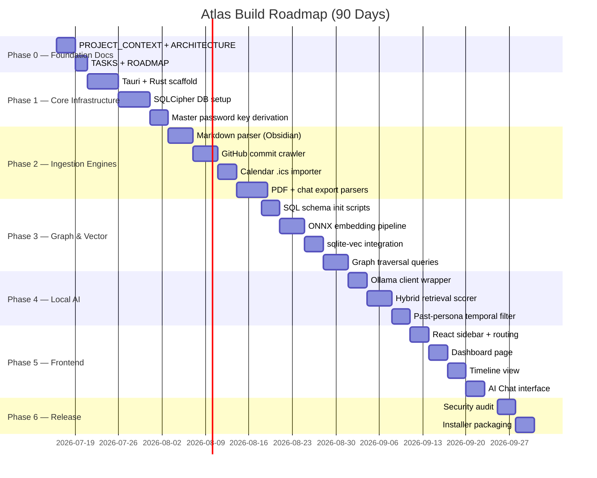

# ATLAS — Required Project Documents & Development Roadmap

**Based on patterns from:** Healthcare/ECG Project · TON-IoT Project · ISRO PS13 Project

---

## PART 1: REQUIRED DOCUMENTS LIST

Analysing your other projects reveals a consistent set of engineering and context documents that every production-quality project in your workspace uses. Below is the **full list of files Atlas needs**, modelled after your existing projects.

---

### 📁 Category 1: Context & Reference (Essential — Create First)

| # | File | What it Contains | Modelled After |
|:--|:-----|:-----------------|:---------------|
| 1 | `PROJECT_CONTEXT.md` | Core technical definitions, system philosophy, what the Identity Graph IS mathematically, entity type taxonomy | Healthcare `PROJECT_CONTEXT.md` |
| 2 | `ARCHITECTURE.md` | Software architecture diagram (text/mermaid), module pipeline from importers → graph → retrieval → LLM, folder-level data flow | Healthcare `ARCHITECTURE.md` |
| 3 | `DECISIONS.md` | Numbered decision log (D-001, D-002...). WHY SQLite over Neo4j, WHY llama.cpp over cloud, WHY Tauri over Electron. Rejected alternatives | TON-IoT `DECISIONS.md` + Healthcare `DECISIONS.md` |
| 4 | `TASKS.md` | Phase-by-phase implementation checklist with `[ ]` / `[x]` status markers, verification targets, success metrics per phase | Healthcare `TASKS.md` |

---

### 📁 Category 2: Roadmaps & Plans (Strategic Navigation)

| # | File | What it Contains | Modelled After |
|:--|:-----|:-----------------|:---------------|
| 5 | `ROADMAP.md` | The big picture roadmap. Weekly → Monthly → 90-Day plan. Phase milestones with objective, deliverables, difficulty, duration. Gantt-style timeline | ISRO `ps13_roadmap.md` |
| 6 | `SPRINT_LOG.md` | Daily/weekly sprint tracking. What was attempted, what was completed, what is blocked, test results with actual numbers | New for Atlas (ISRO used daily logs) |

---

### 📁 Category 3: Technical Specification (Engineering Reference)

| # | File | What it Contains | Modelled After |
|:--|:-----|:-----------------|:---------------|
| 7 | `SCHEMA_REFERENCE.md` | Quick-reference card for database tables. All field names, types, constraints in one compact page. No Prisma syntax — just a readable developer reference | TON-IoT `TON_IoT_Backend_Schema.md` |
| 8 | `DATA_FLOW.md` | How data moves from import → parse → extract → embed → graph → retrieval → LLM. Mermaid sequence diagrams, function-level pipeline maps | TON-IoT `TON_IoT_Flow_Diagram.md` |
| 9 | `LOCAL_AI_GUIDE.md` | How to download, configure, and run Ollama + models locally. Which models to test, expected performance benchmarks (tokens/sec) on different hardware | ISRO `HOW_TO_RUN.md` |

---

### 📁 Category 4: Developer Operations (Build & Run)

| # | File | What it Contains | Modelled After |
|:--|:-----|:-----------------|:---------------|
| 10 | `HOW_TO_RUN.md` | Complete setup instructions for a new developer. Install Rust, Node, Tauri, Ollama, compile SQLCipher. Run dev server. Common errors and fixes | ISRO `HOW_TO_RUN.md` |
| 11 | `ENVIRONMENT.md` | Required software versions (Rust 1.75+, Node 18+, Ollama 0.x), environment variables, `.env.example` template, platform-specific notes | TON-IoT `config.py` pattern |
| 12 | `CHANGELOG.md` | Version history. What changed in each version. Semantic versioning (v0.1.0 → v0.2.0). Breaking changes clearly marked | Standard across all projects |

---

### 📁 Category 5: UI & Design (Frontend Reference)

| # | File | What it Contains | Modelled After |
|:--|:-----|:-----------------|:---------------|
| 13 | `UI_COMPONENTS.md` | Component inventory. Every custom component name, what it renders, what props it takes, which screen it lives on | New — required because Atlas has complex graph/timeline UI |
| 14 | `STITCH_PROMPTS.md` | *(Already exists)* Google Stitch prompt bank for UI generation | Already created |

---

### 📁 Category 6: Reporting & Interview Prep (For Showcasing)

| # | File | What it Contains | Modelled After |
|:--|:-----|:-----------------|:---------------|
| 15 | `INTERVIEW_PREP.md` | Q&A style document. How to explain Atlas to a recruiter, an investor, a developer. Core differentiators, technical depth questions, "why local-first?" answers | TON-IoT `TON_IoT_Interview_Report.md` + ISRO `ISRO_PS13_NOC_Copilot_Interview_Report.md` |

---

### 📁 Documents Already Existing (From Phase 1 Documentation)

| # | File | Status |
|:--|:-----|:-------|
| — | `01_PRD.md` | ✅ Complete |
| — | `02_UX_AND_APP_FLOW.md` | ✅ Complete |
| — | `03_TRD.md` | ✅ Complete |
| — | `04_DATABASE_DESIGN.md` | ✅ Complete |
| — | `05_DESIGN_SYSTEM.md` | ✅ Complete |
| — | `06_IMPLEMENTATION_PLAN.md` | ✅ Complete |
| — | `07_ARCHITECTURE_BIBLE.md` | ✅ Complete |
| — | `README.md` | ✅ Complete |
| — | `STITCH_PROMPTS.md` | ✅ Complete |

---

## PART 2: CREATION PRIORITY ORDER

```
Priority 1 (Create NOW — these unblock everything):
  PROJECT_CONTEXT.md
  ARCHITECTURE.md
  TASKS.md
  ROADMAP.md

Priority 2 (Create when starting code):
  DECISIONS.md
  HOW_TO_RUN.md
  DATA_FLOW.md
  LOCAL_AI_GUIDE.md

Priority 3 (Create as you build):
  SCHEMA_REFERENCE.md
  ENVIRONMENT.md
  UI_COMPONENTS.md
  SPRINT_LOG.md

Priority 4 (Create before showcasing):
  CHANGELOG.md
  INTERVIEW_PREP.md
```

---

## PART 3: DEVELOPMENT ROADMAP

### Phase Overview



---

### Phase 0: Foundation Documents (Days 1–5)

**Objective:** Get all working reference documents in place before writing one line of code.

| Task | File | Duration | Output |
|:-----|:-----|:---------|:-------|
| Write PROJECT_CONTEXT.md | `PROJECT_CONTEXT.md` | 1 day | Entity taxonomy, graph math definitions, confidence model |
| Write ARCHITECTURE.md | `ARCHITECTURE.md` | 1 day | Pipeline diagram: import → extract → embed → graph → LLM |
| Write TASKS.md | `TASKS.md` | 1 day | Phased `[ ]` checklist with verification targets per phase |
| Write ROADMAP.md | `ROADMAP.md` | 1 day | Full 90-day schedule, weekly targets, milestone criteria |
| Write DECISIONS.md | `DECISIONS.md` | 1 day | D-001 through D-010 covering all major tech choices |

---

### Phase 1: Core Infrastructure (Days 6–18)

**Objective:** Running Tauri app + encrypted database + authenticated session.

**Verification Targets:**
- `tauri dev` boots without errors
- `atlas.db` file is unreadable without master passphrase (hex view shows encrypted bytes)
- Passphrase rejection shows correct error; passphrase acceptance opens DB session

| # | Task | Difficulty | Days |
|:--|:-----|:-----------|:-----|
| 1.1 | `npm create tauri-app` scaffolding with React/TS template | Easy | 2 |
| 1.2 | Configure Rust Cargo.toml dependencies (`sqlx`, `rusqlite`, `secrecy`, `argon2`) | Medium | 1 |
| 1.3 | SQLCipher library compilation + dynamic linking setup | Hard | 2 |
| 1.4 | Implement PBKDF2/Argon2id key derivation from master passphrase | Medium | 2 |
| 1.5 | Local Vault initialization and session management | Medium | 2 |
| 1.6 | Local Setup UI (passphrase entry, strength meter, BIP39 recovery key display) | Medium | 4 |

---

### Phase 2: Ingestion Engines (Days 19–35)

**Objective:** Parse real local files → produce structured entity JSON records.

**Verification Targets:**
- Feed 100 Obsidian notes → get at least 80 entity extractions with `confidence > 0.7`
- Git repo of 50 commits → correctly maps languages, dates, project name
- Calendar `.ics` with 20 events → 20 calendar entities with correct timestamps

| # | Task | Difficulty | Days |
|:--|:-----|:-----------|:-----|
| 2.1 | Directory watcher daemon (`notify` crate) | Medium | 2 |
| 2.2 | Markdown parser: frontmatter + heading extractor + link mapper | Hard | 4 |
| 2.3 | GitHub commit crawler: local `git log` reader → Skill, Project entities | Medium | 4 |
| 2.4 | Calendar `.ics` parser → CalendarEvent entities | Easy | 3 |
| 2.5 | PDF text extractor (`pdf-extract` crate) | Medium | 3 |
| 2.6 | Chat export parsers (WhatsApp `.txt`, Telegram `.json`) | Hard | 5 |
| 2.7 | PII anonymizer (hash phone, email, contact names) | Medium | 2 |

---

### Phase 3: Identity Graph & Vector Search (Days 36–53)

**Objective:** Full encrypted graph database + fast semantic vector lookups.

**Verification Targets:**
- Insert 1,000 entity nodes → KNN vector query returns in `< 200ms`
- Version-chain test: update a Belief node → old version preserved with `is_current=0`
- Duplicate detection: feed same entity twice → system flags merge candidate

| # | Task | Difficulty | Days |
|:--|:-----|:-----------|:-----|
| 3.1 | Run SQL schema init (`nodes`, `edges`, all extension tables) | Medium | 2 |
| 3.2 | Configure `ort` crate with `bge-small-en-v1.5` ONNX model file | Hard | 3 |
| 3.3 | Embedding computation workers (async Rust tokio threadpool) | Hard | 4 |
| 3.4 | `sqlite-vec` virtual table integration + KNN query layer | Hard | 4 |
| 3.5 | Entity resolution (dedup detection, merge prompt API) | Medium | 3 |
| 3.6 | Timeline index inserts with version-chain logic | Medium | 2 |

---

### Phase 4: Local AI & Hybrid Retrieval (Days 54–66)

**Objective:** Chat interface backed by hybrid vector+graph+time search, streaming LLM output.

**Verification Targets:**
- "What was I working on in March 2025?" → retrieves relevant entities, generates grounded answer
- Past-persona test: set cutoff June 2024 → response contains zero references to events after June 2024
- Context assembly completes in `< 500ms` before LLM generation starts

| # | Task | Difficulty | Days |
|:--|:-----|:-----------|:-----|
| 4.1 | Ollama REST client wrapper in Rust (`reqwest` or `axum` client) | Easy | 2 |
| 4.2 | Hybrid scorer algorithm: `0.5·semantic + 0.3·graph + 0.2·temporal_decay` | Hard | 4 |
| 4.3 | Past-persona temporal filter (`created_at <= :cutoff` query injection) | Medium | 2 |
| 4.4 | Context packing + recursive summarization for oversized contexts | Hard | 3 |
| 4.5 | Streaming token response handler → Tauri IPC stream | Medium | 2 |

---

### Phase 5: Frontend Interface (Days 67–80)

**Objective:** Pixel-quality UI matching the Stitch design, all screens functional.

**Verification Targets:**
- Dashboard loads in `< 300ms` on a fresh DB with 10,000 nodes
- Timeline virtualizer handles 5,000 events without jank
- Graph canvas renders 500 nodes without frame drops

| # | Task | Difficulty | Days |
|:--|:-----|:-----------|:-----|
| 5.1 | Global sidebar + React Router v6 setup | Easy | 2 |
| 5.2 | Dashboard: hero reflection card, 3-column grid, DNA progress bars | Medium | 4 |
| 5.3 | Timeline: virtualized scroll, category filters, date jump | Hard | 4 |
| 5.4 | AI Chat: 3-panel layout, citation rail, persona switcher | Hard | 4 |
| 5.5 | Settings: source management, password change, backup trigger | Medium | 3 |

---

### Phase 6: Security Audit & Release Packaging (Days 81–90)

**Objective:** Verified local security posture + distributable installers.

| # | Task | Difficulty | Days |
|:--|:-----|:-----------|:-----|
| 6.1 | Penetration test: attempt memory dump of decrypted keys | Hard | 2 |
| 6.2 | WebAssembly plugin sandbox (`wasmtime`) integration | Hard | 3 |
| 6.3 | Tauri bundler: Windows MSI, macOS DMG, Linux `.deb` | Medium | 2 |
| 6.4 | Final security checklist audit | Easy | 1 |
| 6.5 | GitHub release with signed binary checksums | Easy | 2 |

---

### Weekly Breakdown

| Week | Primary Focus | Key Deliverable |
|:-----|:-------------|:----------------|
| **Week 1** (Jul 16–22) | Foundation documents | `PROJECT_CONTEXT`, `TASKS`, `ROADMAP`, `DECISIONS` all written |
| **Week 2** (Jul 23–29) | Tauri scaffold + SQLCipher | App boots, vault creates encrypted DB |
| **Week 3** (Jul 30–Aug 5) | Markdown parser + GitHub crawler | First real entities extracted from local notes |
| **Week 4** (Aug 6–12) | PDF + chat parsers, PII hashing | All Phase 2 importers functional |
| **Week 5** (Aug 13–19) | SQL schema + ONNX embedding | 1,000 nodes in DB with vector index |
| **Week 6** (Aug 20–26) | sqlite-vec KNN + graph traversal | Sub-200ms vector search confirmed |
| **Week 7** (Aug 27–Sep 2) | Ollama client + hybrid scorer | First end-to-end cited AI response |
| **Week 8** (Sep 3–9) | Temporal filter + streaming | Past-persona mode working |
| **Week 9** (Sep 10–16) | Dashboard + Timeline UI | Two major screens functional |
| **Week 10** (Sep 17–23) | AI Chat UI + Settings | All 5 primary screens functional |
| **Week 11** (Sep 24–30) | Security audit + packaging | Release candidates on all 3 platforms |

---

## PART 4: VERIFICATION CHECKPOINTS

These match the `TASKS.md` format used in your healthcare project.

```markdown
### Checkpoint A — Database Security
- [ ] `atlas.db` opened in hex viewer shows random bytes (encrypted ✓)
- [ ] Wrong passphrase returns `SQLITE_NOTADB` error, not data
- [ ] Correct passphrase returns entity count > 0 after test import

### Checkpoint B — Ingestion Accuracy
- [ ] 100 Obsidian notes → ≥ 80 entities extracted (80% extraction rate)
- [ ] Entity types are correctly classified (not all "Memory" type)
- [ ] Confidence scores reflect source quality (multi-reference = higher)
- [ ] PII hashing: email addresses do NOT appear in any DB column as plaintext

### Checkpoint C — Retrieval Speed
- [ ] Vector KNN query on 10,000 nodes returns in < 200ms
- [ ] Hybrid scorer produces ranked list: top result is visibly relevant
- [ ] Temporal slice with cutoff date excludes all post-cutoff nodes

### Checkpoint D — AI Response Quality
- [ ] Answer to "What was I working on in [month]?" returns cited, dated entities
- [ ] Past-persona answer contains zero mentions of post-cutoff events
- [ ] Confidence indicator correctly shows "Low" for sparse-data answers
- [ ] All inline citations [1][2] map to real local file paths

### Checkpoint E — UI Performance
- [ ] Dashboard loads in < 300ms (measured in DevTools)
- [ ] Timeline virtualizer scrolls smoothly with 1,000+ events
- [ ] No network requests visible in DevTools Network tab (local-only verified)
```
